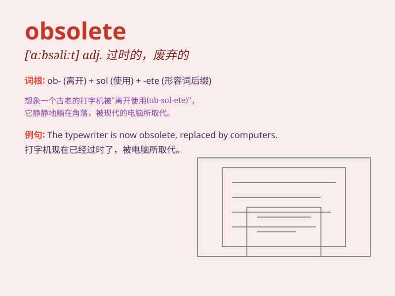

## obsolete

**英音:** _[\'ɒbsəliːt]_ **美音:** _[ɑbsəˌlit]_

**译义:** *adj.荒废的,陈旧的n.废词,陈腐的人*

### 短语

+ **obsolete equipment:** _过时的设备_

+ **obsolete technology:** _陈旧的技术_

+ **become obsolete:** _变得过时_

+ **obsolete language:** _废弃的语言_

+ **obsolete product:** _淘汰产品_

### 例句

#### 例句1

> **The typewriter is now obsolete.**

**中文翻译:** 打字机现在已经过时了。

**单词释义:** 过时的；淘汰的

#### 例句2

> **These laws have become obsolete and need to be revised.**

**中文翻译:** 这些法律已经过时，需要修订。

**单词释义:** 过时的；陈旧的

#### 例句3

> **With the development of technology, many old skills have become
obsolete.**

**中文翻译:** 随着科技的发展，许多旧的技能已经过时了。

**单词释义:** 无用的；废弃的

### 背诵小故事

> A factory was using old machines that were obsolete. Workers
struggled as these machines often broke down. The boss finally realized
and replaced them. \'Obsolete\' means out of date or no longer useful.

**一家工厂正在使用过时的旧机器。工人们很艰难，因为这些机器经常出故障。老板最终意识到并更换了它们。'obsolete'意思是过时的或不再有用的。**

### 图义

