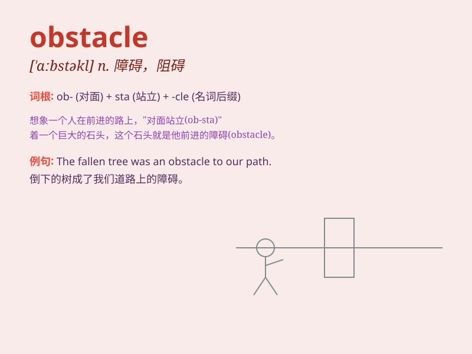

## obstacle

**英音:** _[\'ɒbstək(ə)l]_ **美音:** _[\'ɑbstəkl]_

**译义:** *n.障碍,妨害物*

### 短语

+ **obstacle course:** _障碍赛跑训练场；（跨越）障碍训练场_

+ **major obstacle:** _主要障碍_

+ **overcome obstacle:** _克服障碍_

+ **remove obstacle:** _排除障碍_

+ **face obstacle:** _面临障碍_

### 例句

#### 例句1

> **The biggest obstacle to success is fear of failure.**

**中文翻译:** 成功的最大障碍是对失败的恐惧。

**单词释义:** 障碍

#### 例句2

> **We need to overcome this obstacle to reach our goal.**

**中文翻译:** 我们需要克服这个障碍才能实现我们的目标。

**单词释义:** 障碍

#### 例句3

> **The new road was built to bypass the obstacle.**

**中文翻译:** 新路是为了绕过障碍而修建的。

**单词释义:** 障碍

### 背诵小故事

> A brave adventurer was on a journey. But there was a huge boulder
blocking the path. This boulder was an obstacle. The adventurer had to
find a way around it to continue.

**一位勇敢的冒险家正在旅途中。但有一块巨大的石头挡住了道路。这块石头就是一个障碍。冒险家必须想办法绕过去才能继续前行。**

### 图义

