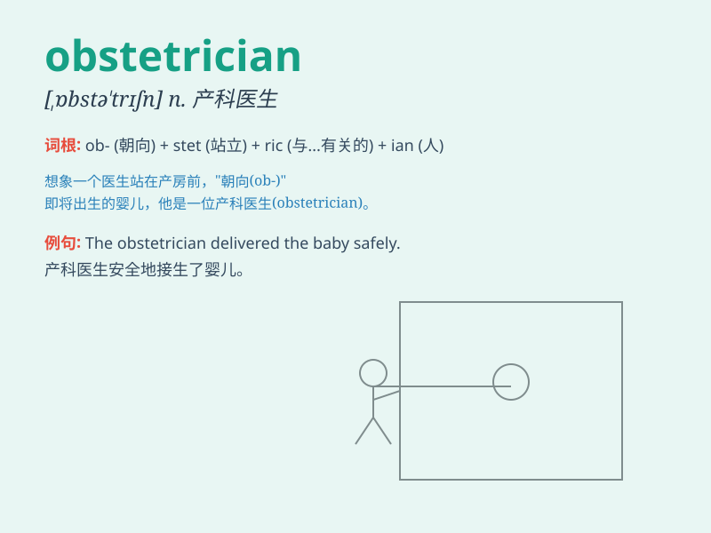

## obstetrician

**英音:** _[,ɒbstə\'trɪʃ(ə)n]_ **美音:**
_[\'ɑbstə\'trɪʃən]_

**译义:** *n.产科医师*

### 短语

+ **obstetrician gynecologist:** _妇产科医生_

+ **certified obstetrician:** _认证产科医生_

+ **experienced obstetrician:** _经验丰富的产科医生_

+ **private obstetrician:** _私人产科医生_

+ **leading obstetrician:** _首席产科医生_

### 例句

#### 例句1

> **The obstetrician monitored the progress of the pregnancy
closely.**

**中文翻译:** 产科医生密切监测妊娠进展。

**单词释义:** 产科医生

#### 例句2

> **She made an appointment with the obstetrician for a prenatal
checkup.**

**中文翻译:** 她预约了产科医生进行产前检查。

**单词释义:** 产科医生

#### 例句3

> **The obstetrician delivered the baby safely.**

**中文翻译:** 产科医生安全地接生了孩子。

**单词释义:** 产科医生

### 背诵小故事

> A pregnant woman was in labor. The obstetrician rushed to the
hospital, ready to help. With professional skills and calmness, the
obstetrician ensured a safe delivery. Remember, an obstetrician is the
expert for childbirth!

**一位孕妇正在分娩。产科医生匆忙赶到医院，准备帮忙。凭借专业技能和沉着冷静，产科医生确保了分娩安全。记住，obstetrician
就是分娩方面的专家！**

### 图义

