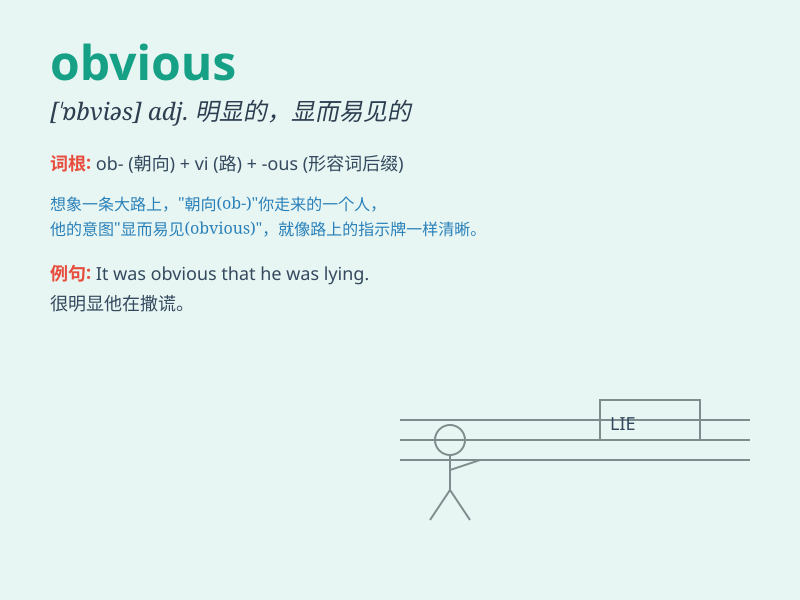

## obvious

**英音:** _[\'ɒbvɪəs]_ **美音:** _[\'ɑbvɪəs]_

**译义:** *adj.明显的,显而易见的*

### 短语

+ **obvious advantage:** _明显的优势_

+ **obvious mistake:** _明显的错误_

+ **obvious choice:** _显而易见的选择_

+ **obvious difference:** _明显的差异_

+ **obvious target:** _明显的目标_

### 例句

#### 例句1

> **It was obvious that she was very angry.**

**中文翻译:** 看得出来，她非常生气。

**单词释义:** 明显的

#### 例句2

> **The mistake was obvious to everyone.**

**中文翻译:** 这个错误对每个人来说都是显而易见的。

**单词释义:** 明显的

#### 例句3

> **His obvious lack of experience was a disadvantage.**

**中文翻译:** 他明显缺乏经验是一个劣势。

**单词释义:** 明显的

### 背诵小故事

> One day, Tom was late for school. His teacher saw him running in and
said, \'It\'s obvious that you overslept.\' Tom lowered his head,
knowing his mistake. Here, \'obvious\' means easily seen or understood.

**一天，汤姆上学迟到了。他的老师看到他跑进来并说：'很明显你睡过头了。'汤姆低下头，知道自己错了。这里，'obvious'意思是容易看到或理解的。**

### 图义

