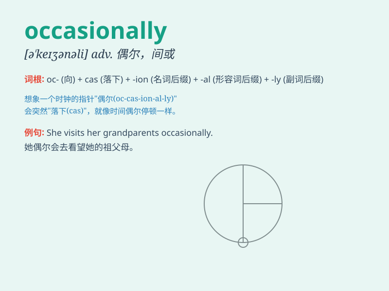

## occasionally

**英音:** _[əˈkeɪʒnəli]_ **美音:** _[o\'keʒənəli]_

**译义:** *adv.有时候,偶而*

### 短语

+ **occasionally absent:** _偶尔缺席_

+ **occasionally visit:** _偶尔拜访_

+ **occasionally late:** _偶尔迟到_

+ **occasionally appear:** _偶尔出现_

+ **occasionally think:** _偶尔思考_

### 例句

#### 例句1

> **I occasionally go for a walk in the park after dinner.**

**中文翻译:** 我偶尔晚饭后去公园散步。

**单词释义:** 偶尔

#### 例句2

> **He occasionally visits his grandparents in the countryside.**

**中文翻译:** 他偶尔会去乡下看望他的祖父母。

**单词释义:** 偶尔

#### 例句3

> **Occasionally, she forgets to lock the door when she leaves
home.**

**中文翻译:** 有时候，她出门时忘记锁门。

**单词释义:** 偶尔

### 背诵小故事

> One day, I was walking in the park. Occasionally, I saw a beautiful
bird. It flew by me and made my day special. It was a rare and
unexpected moment.

**有一天，我在公园散步。偶尔，我看到一只漂亮的鸟。它从我身边飞过，让我的这一天变得特别。这是一个罕见且出乎意料的时刻。**

### 图义

