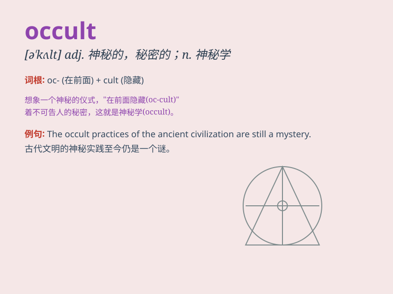

## occult

**英音:** _[ɒ\'kʌlt; \'ɒkʌlt]_ **美音:** _[ə\'kʌlt]_

**译义:**
*adj.神秘的,玄妙的,不可思议的,超自然的v.掩蔽,隐藏n.神秘之事*

### 短语

+ **occult science:** _神秘学_

+ **occult power:** _神秘力量_

+ **occult practice:** _神秘的实践_

+ **occult symbol:** _神秘的符号_

+ **occult knowledge:** _神秘知识_

### 例句

#### 例句1

> **The occult practices were shrouded in mystery and secrecy.**

**中文翻译:** 神秘的做法笼罩在神秘和秘密之中。

**单词释义:** 神秘的；超自然的

#### 例句2

> **She was drawn to the occult world of astrology and tarot.**

**中文翻译:** 她被占星术和塔罗牌的神秘世界所吸引。

**单词释义:** 神秘学；超自然现象

#### 例句3

> **Some people believe in the power of occult forces to influence
their lives.**

**中文翻译:** 有些人相信神秘力量可以影响他们的生活。

**单词释义:** 神秘的力量

### 背诵小故事

>
在一个神秘的夜晚，一位学者在古老的图书馆中寻找着被隐藏的知识。他发现了一本标有\'OCCULT\'的书籍，里面记载着神秘的魔法和不为人知的秘密。

**在一个神秘的夜晚，一位学者在古老的图书馆中寻找被隐藏的、神秘的知识。他发现了标有\'occult（神秘的；超自然的；隐秘的）\'的书籍，里面记载着神秘的魔法和不为人知的秘密。**

### 图义

