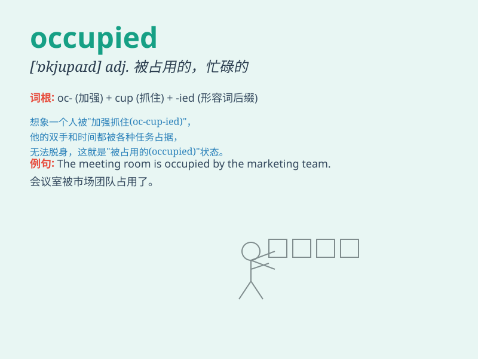

## occupied

**英音:** _[ˈɒkjʊpaɪd]_ **美音:** _[ˈɑːkjəˌpaɪd]_

**译义:** *adj.被占用的，忙碌的，被占领的；vt.占据，使忙碌，占用*

### 短语

+ **be occupied with:** _忙于；从事于_

+ **occupied territory:** _被占领土_

+ **remain occupied:** _保持忙碌_

+ **occupied hours:** _占用的时间_

+ **fully occupied:** _完全忙碌；全神贯注_

### 例句

#### 例句1

> **The bathroom is occupied.**

**中文翻译:** 浴室有人在用。

**单词释义:** 被占用的；使用中的

#### 例句2

> **She occupied herself with reading.**

**中文翻译:** 她使自己忙于阅读。

**单词释义:** 使忙于

#### 例句3

> **The enemy occupied the town.**

**中文翻译:** 敌人占领了这个城镇。

**单词释义:** 占领

### 背诵小故事

> A soldier was on a mission and found himself in an occupied
territory. He had to be very cautious as every step could be dangerous.
The word \'occupied\' means taken or filled.

**一名士兵在执行任务时发现自己身处被占领的地区。他必须非常小心，因为每一步都可能很危险。单词\'occupied\'意思是被占用的、被占据的。**

### 图义

