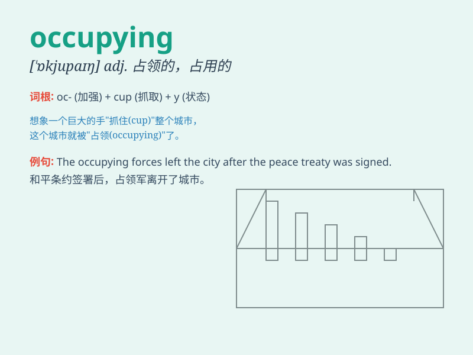

## occupying

**英音:** _[ˈɒkjupaɪŋ]_ **美音:** _[ˈɑːkjupaɪŋ]_

**译义:** *adj. 占用的，占领的；占据的；占优势的；v.
占领，占据（occupy的ing形式）*

### 短语

+ **occupying force:** _占领军_

+ **occupying power:** _占领国；占领方_

+ **occupying troops:** _占领军；占领部队_

+ **occupying state:** _占领国；占领状态_

+ **be occupying oneself with:** _忙于；专心于_

### 例句

#### 例句1

> **The army is occupying the enemy\'s territory.**

**中文翻译:** 军队正在占领敌人的领土。

**单词释义:** 占领

#### 例句2

> **She is occupying herself with reading a novel.**

**中文翻译:** 她正忙于读一本小说。

**单词释义:** 使忙于

#### 例句3

> **The thought of the upcoming exam is occupying his mind.**

**中文翻译:** 即将到来的考试的想法占据了他的脑海。

**单词释义:** 占据

### 背诵小故事

> A soldier was occupying a strategic position during the war. He was
determined to hold it and not let the enemy pass. This act of occupying
showed his bravery and commitment.

**一位士兵在战争期间占领着一个战略要地。他决心坚守不让敌人通过。这种占领的行为展现了他的勇敢和决心。**

### 图义

