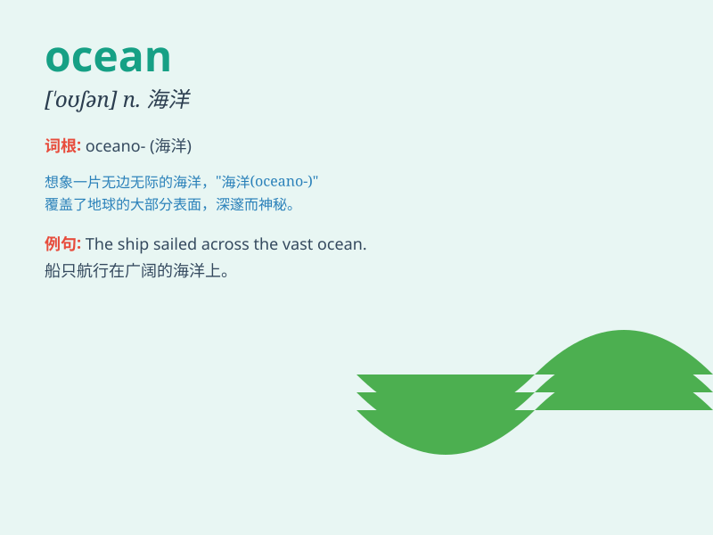

## ocean

**英音:** _[\'əʊʃ(ə)n]_ **美音:** _[\'oʃən]_

**译义:** *n.大海,海洋,许多,广阔*

### 短语

+ **ocean floor:** _洋底；海底_

+ **ocean current:** _洋流_

+ **ocean liner:** _远洋客轮_

+ **ocean view:** _海景_

+ **ocean park:** _海洋公园_

### 例句

#### 例句1

> **The ocean is vast and mysterious.**

**中文翻译:** 海洋广阔而神秘。

**单词释义:** 海洋

#### 例句2

> **They went on a cruise across the ocean.**

**中文翻译:** 他们乘游轮横渡大洋。

**单词释义:** 海洋

#### 例句3

> **The pollution of the ocean is a serious problem.**

**中文翻译:** 海洋污染是一个严重的问题。

**单词释义:** 海洋

### 背诵小故事

> One day, a little fish was lost in the vast ocean. It swam and swam,
passing colorful corals and strange creatures. Finally, it found its way
home. The ocean is so big and full of wonders!

**有一天，一条小鱼在广阔的海洋中迷路了。它游啊游，经过了五颜六色的珊瑚和奇怪的生物。最后，它找到了回家的路。海洋是如此之大，充满了奇迹！**

### 图义

