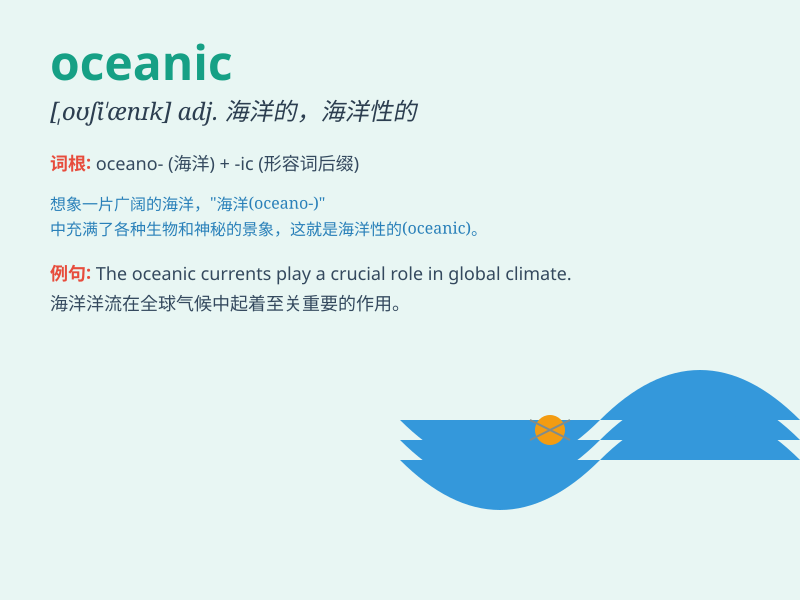

## oceanic

**英音:** _[,əʊsɪ\'ænɪk; -ʃɪ-]_ **美音:**
_[\'oʃɪ\'ænɪk]_

**译义:** *adj.海洋的,海洋产出的,生活于海洋的*

### 短语

+ **oceanic climate:** _海洋性气候_

+ **oceanic crust:** _海洋地壳_

+ **oceanic island:** _海洋岛屿_

+ **oceanic current:** _洋流_

+ **oceanic fish:** _海洋鱼类_

### 例句

#### 例句1

> **The oceanic climate is mild and humid.**

**中文翻译:** 海洋性气候温和湿润。

**单词释义:** 海洋的；与海洋有关的

#### 例句2

> **Oceanic exploration is a challenging task.**

**中文翻译:** 海洋探索是一项具有挑战性的任务。

**单词释义:** 海洋的

#### 例句3

> **The ship was lost in the oceanic expanse.**

**中文翻译:** 这艘船在广阔的海洋中迷失了。

**单词释义:** 海洋的；广阔的

### 背诵小故事

> A brave sailor was on an oceanic adventure. He saw huge waves and
beautiful fish. The vast oceanic world was both mysterious and
wonderful. It made him love the ocean even more.

**一位勇敢的水手正在进行一次海洋探险。他看到了巨大的海浪和美丽的鱼儿。广阔的海洋世界既神秘又美妙。这让他更加热爱海洋。**

### 图义

