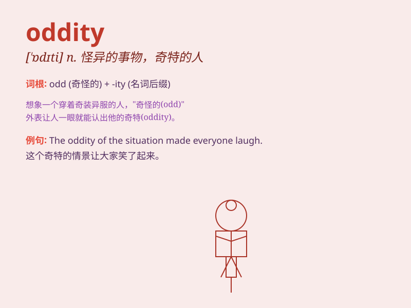

## oddity

**英音:** _[\'ɒdɪtɪ]_ **美音:** _[\'ɑdəti]_

**译义:** *n.奇异,古怪,怪癖*

### 短语

+ **oddity of nature:** _自然的奇异现象_

+ **peculiar oddity:** _奇特的怪异之处_

+ **oddity behavior:** _古怪的行为_

+ **rare oddity:** _罕见的奇异事物_

+ **cultural oddity:** _文化上的奇异现象_

### 例句

#### 例句1

> **The old man\'s behavior was an oddity that attracted a lot of
attention.**

**中文翻译:** 老人的举动有些古怪，引起了很多人的注意。

**单词释义:** 奇特之处；怪异的事物

#### 例句2

> **She was regarded as an oddity in the small town.**

**中文翻译:** 她在小镇上被视为一个怪人。

**单词释义:** 怪人；古怪的人

#### 例句3

> **The oddity of the situation made everyone confused.**

**中文翻译:** 诡异的情况让所有人都摸不着头脑。

**单词释义:** 怪异；古怪

### 背诵小故事

> One day, I went to a strange fair. There was an oddity - a man with a
three-legged dog. Everyone was amazed. This odd scene made me remember
the word \'oddity\' which means something strange or unusual.

**有一天，我去了一个奇怪的集市。有一个奇特之处------一个男人带着一只三条腿的狗。每个人都很惊讶。这个奇怪的场景让我记住了'oddity'这个词，它指的是奇怪或不寻常的事物。**

### 图义

