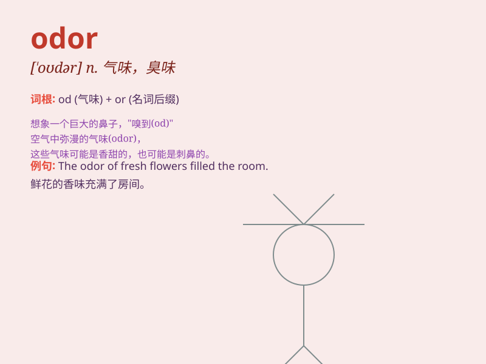

## odor

**英音:** _[\'əʊdə]_ **美音:** _[\'oʊdə]_

**译义:** *n.气味,名声*

### 短语

+ **bad odor:** _难闻的气味_

+ **pleasant odor:** _宜人的气味_

+ **strong odor:** _强烈的气味_

+ **faint odor:** _微弱的气味_

+ **peculiar odor:** _奇特的气味_

### 例句

#### 例句1

> **The odor of fresh flowers filled the room.**

**中文翻译:** 房间里充满了鲜花的香味。

**单词释义:** 气味；臭味

#### 例句2

> **There was a strange odor coming from the basement.**

**中文翻译:** 地下室里传来一股奇怪的气味。

**单词释义:** 气味；臭味

#### 例句3

> **The odor of the food made me hungry.**

**中文翻译:** 食物的香味让我感到饥饿。

**单词释义:** 气味；香味

### 背诵小故事

> A little mouse was exploring a mysterious cave. Suddenly, it smelled
a strange odor. It followed the odor and found a hidden treasure chest.
The odor led it to a big discovery!

**一只小老鼠正在探索一个神秘的洞穴。突然，它闻到了一股奇怪的气味。它顺着气味，发现了一个隐藏的宝箱。这股气味引领它有了重大发现！**

### 图义

