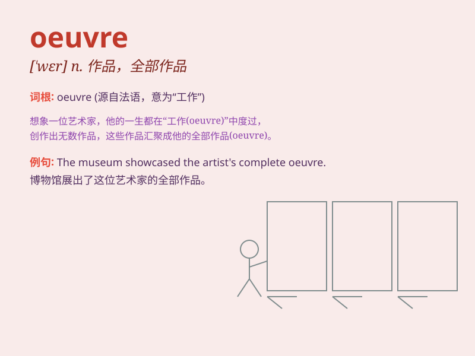

## oeuvre

**英音:** _[ˈɜːvrə]_ **美音:** _[ˈɜːrvrə]_

**译义:** *n. 作品全集；全部作品*

### 短语

+ **oeuvre d\'art:** _艺术作品_

+ **the complete oeuvre:** _全部作品_

+ **oeuvre critique:** _评论性作品_

+ **oeuvre littéraire:** _文学作品_

+ **oeuvre musicale:** _音乐作品_

### 例句

#### 例句1

> **His oeuvre includes many famous paintings and sculptures.**

**中文翻译:** 他的全部作品包括许多著名的绘画和雕塑。

**单词释义:** 全部作品

#### 例句2

> **The artist\'s oeuvre reflects his changing styles over the
years.**

**中文翻译:** 这位艺术家的作品反映了他多年来风格的变化。

**单词释义:** 作品

#### 例句3

> **She spent years studying his oeuvre to understand his creative
process.**

**中文翻译:** 她花了多年时间研究他的作品以了解他的创作过程。

**单词释义:** 作品

### 背诵小故事

> A famous artist spent years creating his oeuvre. Each painting and
sculpture was like a piece of his soul. Finally, his oeuvre was
displayed in a grand museum, making people admire his talent and
dedication.

**一位著名的艺术家花费多年创作他的全部作品。每一幅画和每一座雕塑都像是他灵魂的一部分。最终，他的全部作品在一个大型博物馆展出，让人们钦佩他的才华和奉献精神。**

### 图义

