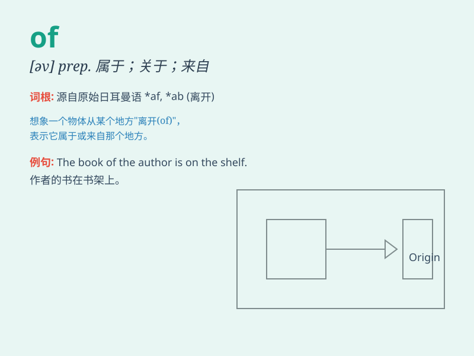

## of

**英音:** _[ɒv; (ə)v]_ **美音:** _[ʌv; əv]_

**译义:** * prep\....的,由\...制成的,离,关于,对于*

### 短语

+ **of course:** _当然_

+ **because of:** _因为；由于_

+ **a lot of:** _许多；大量_

+ **out of:** _从......里面（走出）；离开_

+ **in front of:** _在......前面_

### 例句

#### 例句1

> **The book is of great value.**

**中文翻译:** 这本书很有价值。

**单词释义:** 具有；关于

#### 例句2

> **A cup of coffee, please.**

**中文翻译:** 请喝杯咖啡。

**单词释义:** 表示数量

#### 例句3

> **He is a friend of mine.**

**中文翻译:** 他是我的朋友。

**单词释义:** 属于；...的

### 背诵小故事

> Once upon a time, there was a little prince. All the treasures of the
kingdom were \'of\' great value. \'Of\' here shows possession and
connection. It means belonging to or relating to something.

**从前，有一位小王子。王国里所有的财宝都具有极大的价值。这里的'of'表示所属和关联。它意味着属于或关于某物。**

### 图义

