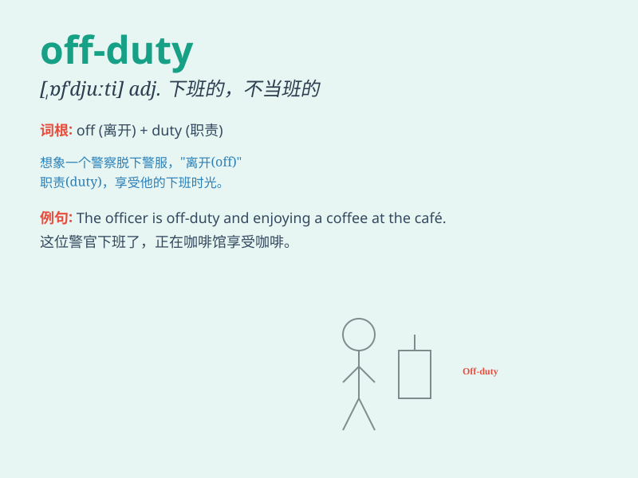

## off-duty

**英音:** _[ɒf \'djuːti]_ **美音:** _[ɔːf \'duːti]_

**译义:** *adj. 下班的；不当班的；非职务上的*

### 短语

+ **off-duty time:** _下班时间_

+ **off-duty officer:** _休班的官员_

+ **off-duty hours:** _非工作时间_

+ **off-duty day:** _休息日_

+ **off-duty status:** _下班状态_

### 例句

#### 例句1

> **The police officer was off-duty when he witnessed the
accident.**

**中文翻译:** 这位警察在目睹事故时处于休班状态。

**单词释义:** 休班的；不值班的

#### 例句2

> **She looks more relaxed when she\'s off-duty.**

**中文翻译:** 她不上班的时候看起来更放松。

**单词释义:** 下班的；不在工作的

#### 例句3

> **The doctor is off-duty today and won\'t be available for
consultations.**

**中文翻译:** 这位医生今天不值班，无法提供咨询。

**单词释义:** 不值班；休班

### 背诵小故事

> One day, a police officer was off-duty. He took off his uniform and
went for a walk in the park. He enjoyed the peaceful time without the
stress of work. \'Off-duty\' means not working or being on a break from
work.

**有一天，一位警察下班了。他脱下制服去公园散步。他享受着没有工作压力的平静时光。\'off-duty\'意思是下班或不在工作中，处于休息状态。**

### 图义

