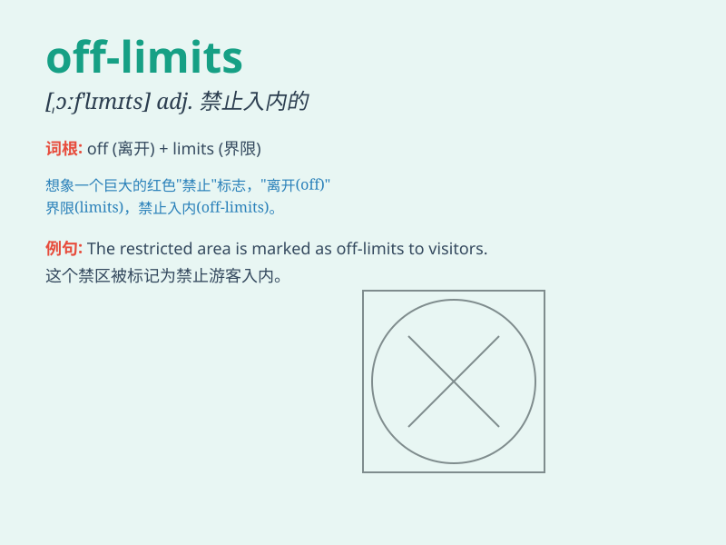

## off-limits

**英音:** _[ˌɒf ˈlɪmɪts]_ **美音:** _[ˌɔːf ˈlɪmɪts]_

**译义:** *adj.禁止入内的；限制进入的*

### 短语

+ **be off-limits:** _被禁止；禁止入内_

+ **remain off-limits:** _仍然禁止；依然禁止进入_

+ **declare something off-limits:** _宣布某事禁止_

+ **consider an area off-limits:** _认为某区域禁止进入_

+ **make a place off-limits:** _使某地禁止入内_

### 例句

#### 例句1

> **The area behind the factory is off-limits to the public.**

**中文翻译:** 工厂后面的区域禁止公众进入。

**单词释义:** 禁止进入的

#### 例句2

> **This room is off-limits during the meeting.**

**中文翻译:** 在会议期间这个房间禁止使用。

**单词释义:** 禁止使用的

#### 例句3

> **The military base is strictly off-limits.**

**中文翻译:** 这个军事基地严格禁止入内。

**单词释义:** 禁止入内的

### 背诵小故事

> A group of friends wanted to explore an old building. But a sign said
\'off-limits\'. It meant they weren\'t allowed to enter. They had to
respect the rule and find somewhere else to have fun.

**一群朋友想去探索一座老建筑。但有个牌子写着"禁止入内"。这意味着他们不被允许进入。他们不得不遵守规则，另找地方去玩。**

### 图义

