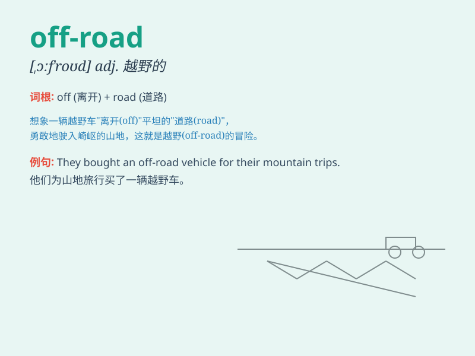

## off-road

**英音:** _[ɒfˈrəʊd]_ **美音:** _[ɔfˈrod]_

**译义:**
*adj.越野的；在公路上的；n.越野车；v.离开公路；在野外行驶*

### 短语

+ **off-road vehicle:** _越野车辆_

+ **off-road adventure:** _越野冒险_

+ **off-road driving:** _越野驾驶_

+ **off-road track:** _越野赛道_

+ **off-road enthusiast:** _越野爱好者_

### 例句

#### 例句1

> **The new SUV is designed for off-road adventures.**

**中文翻译:** 这款新的 SUV 是为越野冒险而设计的。

**单词释义:** 越野的

#### 例句2

> **He loves to go off-road on his motorcycle.**

**中文翻译:** 他喜欢骑着摩托车去越野。

**单词释义:** 越野的

#### 例句3

> **Off-road driving requires special skills and equipment.**

**中文翻译:** 越野驾驶需要特殊的技能和设备。

**单词释义:** 越野的

### 背诵小故事

> One day, a brave adventurer decided to take an off-road trip. His car
left the smooth main road and entered the rough and challenging paths.
He had fun exploring the wild, which showed the meaning of off-road -
away from normal roads.

**有一天，一位勇敢的冒险家决定进行一次越野旅行。他的车离开了平坦的主路，驶入了崎岖且具有挑战性的道路。他在野外探索中玩得很开心，这体现了
off-road 的意思------离开正常道路。**

### 图义

