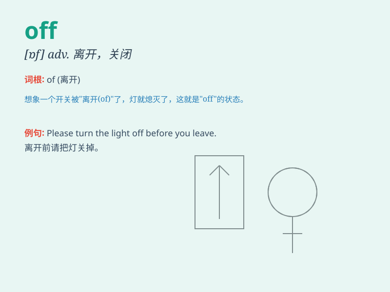

## off

**英音:** _[ɒf]_ **美音:** _[ɔf]_

**译义:**
*adj.远的,空闲的,不工作的adv.离开,在远方,离去,分离,中断,完成
prep.从\...离开,脱离*

### 短语

+ **off and on:** _断断续续地；有时_

+ **off duty:** _下班；不当班_

+ **off the mark:** _不准确；不相关_

+ **off the record:** _非正式的；不供发表的_

+ **off the top of one\'s head:** _未经深思熟虑；不假思索_

### 例句

#### 例句1

> **The meeting is off.**

**中文翻译:** 会议结束了。

**单词释义:** 取消；中止

#### 例句2

> **She took her coat off.**

**中文翻译:** 她脱掉外套。

**单词释义:** 脱下；脱掉

#### 例句3

> **The car drove off.**

**中文翻译:** 车子开走了。

**单词释义:** 离开；离去

### 背诵小故事

> One day, a car was running on the road. Suddenly, the engine turned
off. The driver had to call for help. \'Off\' here means not working or
not operating.

**一天，一辆车在路上行驶。突然，引擎熄火了。司机不得不求助。这里的'off'意思是不工作或停止运行。**

### 图义

