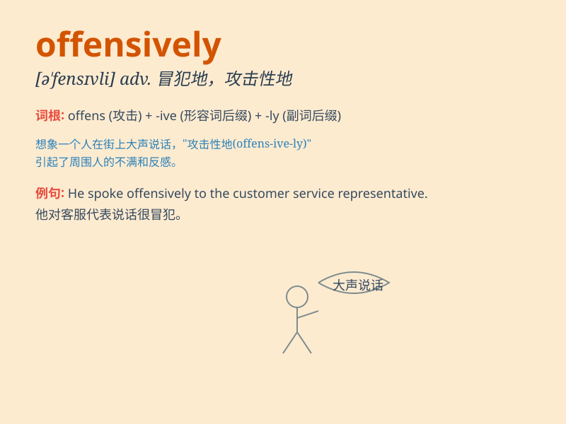

## offensively

**英音:** _[ə\'fensɪvli]_ **美音:** _[ə\'fensɪvli]_

**译义:** *adv.不愉快地,讨厌地*

### 短语

+ **offensively armed:** _攻击性地武装_

+ **offensively aggressive:** _冒犯性地挑衅_

+ **offensively loud:** _令人不快地大声_

+ **act offensively:** _行为冒犯_

+ **speak offensively:** _说话冒犯_

### 例句

#### 例句1

> **He behaved offensively at the party.**

**中文翻译:** 他在聚会上表现得很无礼。

**单词释义:** 无礼地；冒犯地

#### 例句2

> **The team played offensively and scored several goals.**

**中文翻译:** 球队进攻积极，打入多个进球。

**单词释义:** 进攻地

#### 例句3

> **She spoke offensively to her colleagues.**

**中文翻译:** 她对同事说脏话。

**单词释义:** 冒犯地

### 背诵小故事

> A soldier was punished for behaving offensively in the army. He
shouted rudely at his comrades and didn\'t follow the rules. This
behavior made everyone unhappy. Remember, don\'t be offensively like
him.

**一名士兵因在军队中表现得具有冒犯性而受到惩罚。他粗鲁地对战友大喊大叫，不遵守规则。这种行为让大家都不高兴。记住，别像他那样具有冒犯性。**

### 图义

