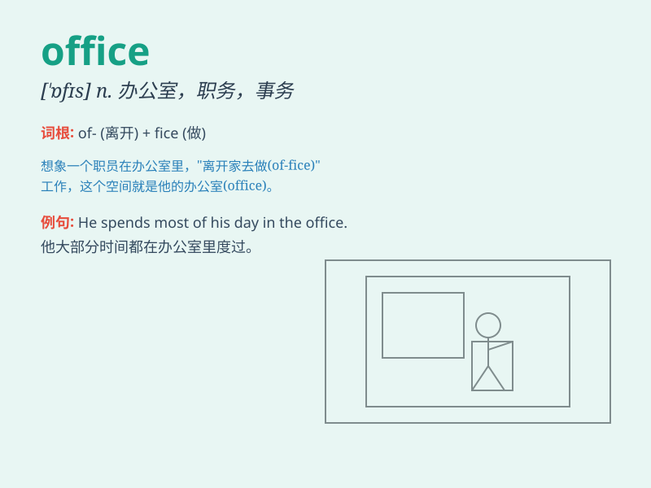

## office

**英音:** _[\'ɒfɪs]_ **美音:** _[\'ɔfɪs]_

**译义:**
*n.办公室,办事处,事务所,\<英>政府机关,部,公职,职责,帮助*

### 短语

+ **post office:** _邮局_

+ **office building:** _办公大楼_

+ **office hours:** _办公时间_

+ **box office:** _票房；售票处_

+ **home office:** _（英国）内政部_

### 例句

#### 例句1

> **He works in an office downtown.**

**中文翻译:** 他在市中心的一间办公室工作。

**单词释义:** 办公室

#### 例句2

> **The doctor\'s office is on the second floor.**

**中文翻译:** 医生的办公室在二楼。

**单词释义:** 诊室；办公室

#### 例句3

> **She has an important meeting in the office this afternoon.**

**中文翻译:** 今天下午她在办公室有一个重要的会议。

**单词释义:** 办公室

### 背诵小故事

> One day, Tom was lost. He asked a kind lady for help. The lady
pointed to a building and said, \'That is an office. Maybe someone there
can assist you.\' Tom thanked her and went to the office to find help.

**一天，汤姆迷路了。他向一位善良的女士求助。女士指着一栋楼说：'那是一间办公室。也许那里有人能帮助你。'汤姆谢过她，然后去了办公室寻求帮助。**

### 图义

