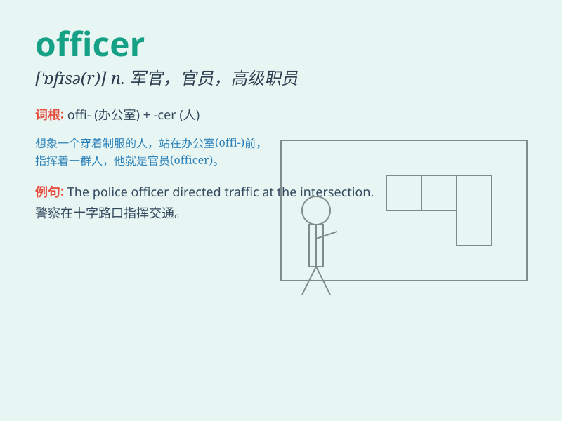

## officer

**英音:** _[\'ɒfɪsə]_ **美音:** _[\'ɔfɪsɚ]_

**译义:** *n.政府官员,军官,警官,船长vt.指挥*

### 短语

+ **police officer:** _警察_

+ **customs officer:** _海关官员_

+ **military officer:** _军官_

+ **executive officer:** _行政官员_

+ **officer in charge:** _主管官员_

### 例句

#### 例句1

> **The police officer is very brave.**

**中文翻译:** 这位警察非常勇敢。

**单词释义:** 警察

#### 例句2

> **The customs officer checked my passport carefully.**

**中文翻译:** 海关官员仔细检查了我的护照。

**单词释义:** 官员

#### 例句3

> **He is an officer in the army.**

**中文翻译:** 他是军队中的一名军官。

**单词释义:** 军官

### 背诵小故事

> A brave man named Jack wanted to become an officer. One day, he saw a
thief. He chased and caught the thief. His brave act made him an
officer. Now, people respect him.

**一个叫杰克的勇敢男人想成为一名官员。有一天，他看到一个小偷。他追上去并抓住了小偷。他的勇敢行为使他成为了一名官员。现在，人们尊敬他。**

### 图义

