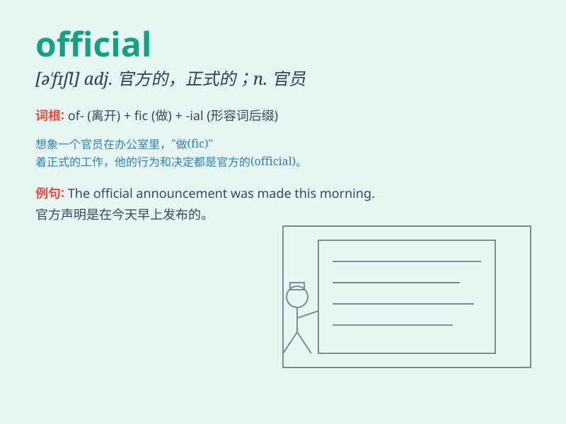

## official

**英音:** _[ə\'fɪʃ(ə)l]_ **美音:** _[əˈfɪʃəl; oʊˈfɪʃəl]_

**译义:** *n.官员,公务员adj.职务上的,公务的,官方的,正式的*

### 短语

+ **official document:** _官方文件；正式文件_

+ **official language:** _官方语言；正式语言_

+ **official business:** _公务；公事_

+ **official statement:** _官方声明；正式声明_

+ **official position:** _官方立场；正式职位_

### 例句

#### 例句1

> **The official opening of the store will be next week.**

**中文翻译:** 该店将于下周正式开业。

**单词释义:** 正式的

#### 例句2

> **He is an official from the government.**

**中文翻译:** 他是政府官员。

**单词释义:** 官员

#### 例句3

> **The official report was released yesterday.**

**中文翻译:** 官方报告于昨天发布。

**单词释义:** 官方的

### 背诵小故事

> A king needed an official to manage his treasures. One brave man
showed great skills and honesty and was chosen. The king trusted him as
the official. With responsibility, he protected the treasures well.

**一位国王需要一名官员来管理他的财宝。一个勇敢的人展现出了高超的技能和诚实，被选中了。国王信任他作为官员。他肩负责任，很好地保护了财宝。**

### 图义

