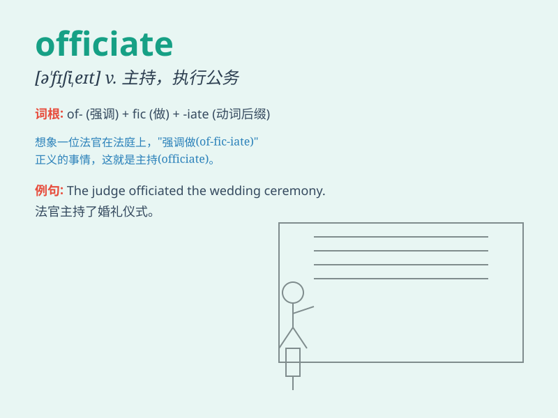

## officiate

**英音:** _[ə\'fɪʃɪeɪt]_ **美音:** _[o\'fɪʃɪet]_

**译义:** *v.行使*

### 短语

+ **officiate at:** _主持（仪式、比赛等）_

+ **officiate as:** _充当（裁判、主持人等）_

+ **officiate in:** _在（某个领域、活动）中执行职务_

+ **officiate over:** _监督；掌管_

+ **officiate for:** _为\...\...执行职务_

### 例句

#### 例句1

> **The priest will officiate at the wedding ceremony.**

**中文翻译:** 牧师将主持婚礼。

**单词释义:** 主持（仪式）

#### 例句2

> **He was asked to officiate the football game.**

**中文翻译:** 他被要求主持足球比赛。

**单词释义:** 主持（比赛）

#### 例句3

> **The referee will officiate the tennis match.**

**中文翻译:** 裁判员将主持网球比赛。

**单词释义:** 执法；担任裁判

### 背诵小故事

> A young man was chosen to officiate at the local sports event. He was
nervous but did a great job, making sure everything ran smoothly. The
word \'officiate\' means to act as an official in a ceremony or game.

**一个年轻人被选中在当地的体育赛事中担任裁判。他很紧张但做得很棒，确保一切顺利进行。单词\'officiate\'意思是在仪式或比赛中担任官员。**

### 图义

