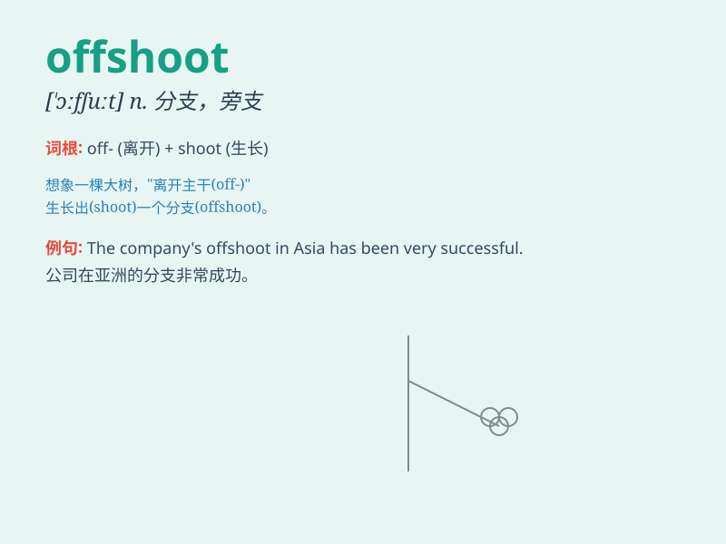

## offshoot

**英音:** _[\'ɒfʃuːt]_ **美音:** _[\'ɔfʃut]_

**译义:** *n.分支,支流*

### 短语

+ **offshoot branch:** _分支；旁支_

+ **offshoot company:** _分公司；子公司_

+ **offshoot product:** _衍生产品_

+ **offshoot idea:** _派生的想法；衍生的主意_

+ **offshoot movement:** _分支运动；派生运动_

### 例句

#### 例句1

> **The new company is an offshoot of the original one.**

**中文翻译:** 新公司是原公司的一个分支。

**单词释义:** 分支；衍生物

#### 例句2

> **This theory is an offshoot of the main idea in his research.**

**中文翻译:** 该理论是他的研究主要思想的一个分支。

**单词释义:** 派生；分支

#### 例句3

> **The small village was an offshoot of the larger town.**

**中文翻译:** 这个小村庄是大城镇的一个分支。

**单词释义:** 分支；旁支

### 背诵小故事

> A big tree has many offshoots. One of them wanted to grow tall and
strong like the main trunk. It worked hard and finally became a
beautiful offshoot.

**一棵大树有很多分枝。其中一个分枝想要像主干一样长得又高又壮。它努力生长，最终成为了一条漂亮的分枝。**

### 图义

