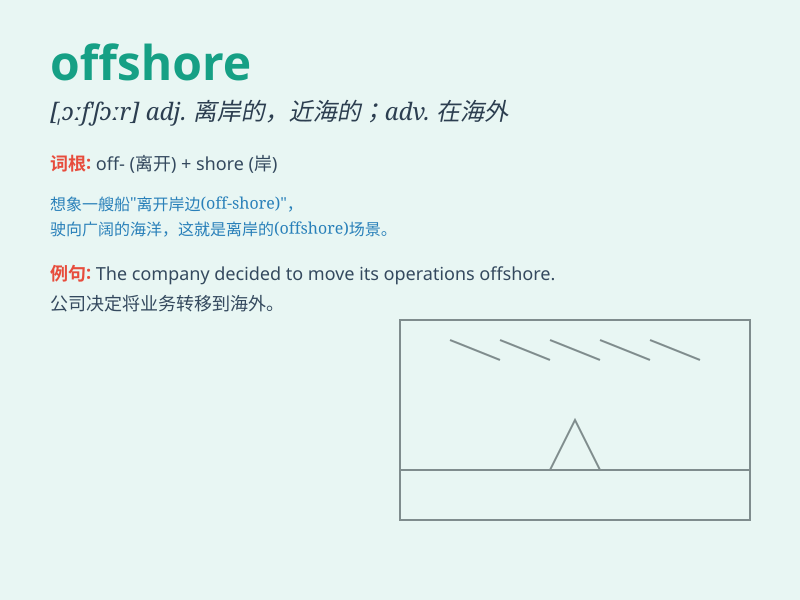

## offshore

**英音:** _[\'ɒfʃɔː; ɒf\'ʃɔː]_ **美音:** _[,ɔf\'ʃɔr]_

**译义:** *adj.向海面吹的,离岸的,海面上的*

### 短语

+ **offshore wind:** _海上风_

+ **offshore drilling:** _近海钻探_

+ **offshore account:** _海外账户_

+ **offshore platform:** _海上平台_

+ **offshore fishery:** _近海渔业_

### 例句

#### 例句1

> **The company has an offshore oil rig in the Gulf of Mexico.**

**中文翻译:** 该公司在墨西哥湾拥有一座海上石油钻井平台。

**单词释义:** 近海的

#### 例句2

> **He decided to move his money to an offshore bank account.**

**中文翻译:** 他决定将钱转移到离岸银行账户。

**单词释义:** 境外的

#### 例句3

> **The wind farm is located offshore, several miles from the
coast.**

**中文翻译:** 该风电场位于近海，距海岸数英里。

**单词释义:** 海上的

### 背诵小故事

> A brave sailor was on a journey. When he went far from the coast, he
was in the offshore area. The wind was strong but he wasn\'t afraid. He
knew he was exploring the unknown offshore world.

**一位勇敢的水手在旅行。当他远离海岸时，他就处于近海区域。风很大，但他并不害怕。他知道自己正在探索未知的近海世界。**

### 图义

