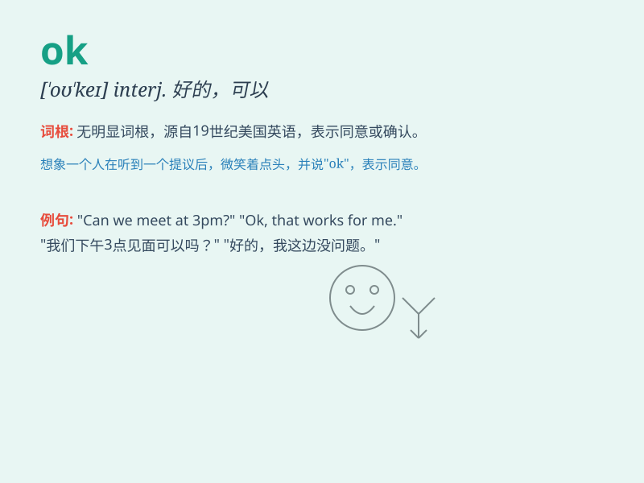

## OK

**英音:** _[əʊˈkeɪ]_ **美音:** _[oʊˈkeɪ]_

**译义:** *int. 好，行；adv. 好，不错；adj. 好的，可以接受的*

### 短语

+ **OK for:** _对\...\...合适_

+ **OK with:** _对\...\...没问题_

+ **be OK:** _没事；还好_

+ **That\'s OK:** _没关系；不要紧_

+ **OK then:** _那好吧_

### 例句

#### 例句1

> **The plan is OK.**

**中文翻译:** 这个计划没问题。

**单词释义:** 令人满意的；可以接受的

#### 例句2

> **OK, let\'s go.**

**中文翻译:** 好的，咱们走吧。

**单词释义:** 好；行；可以

#### 例句3

> **Is everything OK?**

**中文翻译:** 一切都好吗？

**单词释义:** 好；正常；不错

### 背诵小故事

>
在一次紧急的救援行动中，大家都很紧张。当任务成功完成时，队长竖起大拇指喊\'OK\'，所有人都欢呼起来。这个简单的\'OK\'代表着一切顺利、没有问题，是成功和放心的象征。

**在一次紧急救援行动中，任务成功完成时队长喊出\'OK\'，代表一切顺利，以此辅助记忆\'OK\'这个单词。**

### 图义

