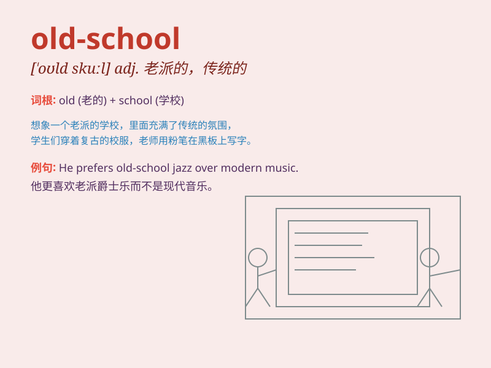

## old-school

**英音:** _[əʊld skuːl]_ **美音:** _[oʊld skuːl]_

**译义:** *adj. 老派的，传统的；怀旧的；守旧的*

### 短语

+ **old-school style:** _老派风格_

+ **old-school music:** _老式音乐_

+ **old-school values:** _传统价值观_

+ **old-school thinking:** _守旧思维_

+ **old-school methods:** _陈旧方法_

### 例句

#### 例句1

> **He has an old-school approach to business.**

**中文翻译:** 他在做生意方面有一种守旧的方法。

**单词释义:** 守旧的；传统的

#### 例句2

> **The old-school music still has its charm.**

**中文翻译:** 这种传统的音乐仍然有它的魅力。

**单词释义:** 传统的

#### 例句3

> **I prefer the old-school style of teaching.**

**中文翻译:** 我更喜欢传统的教学方式。

**单词释义:** 传统的

### 背诵小故事

> There was a young artist who always pursued new styles. But one day,
he met an old-school painter. The painter insisted on traditional
techniques and classic themes. This encounter made the artist understand
the charm and value of the old ways.

**有一位年轻的艺术家总是追求新的风格。但有一天，他遇到了一位守旧派的画家。这位画家坚持传统的技法和经典的主题。这次相遇让这位艺术家明白了旧方式的魅力和价值。**

### 图义

