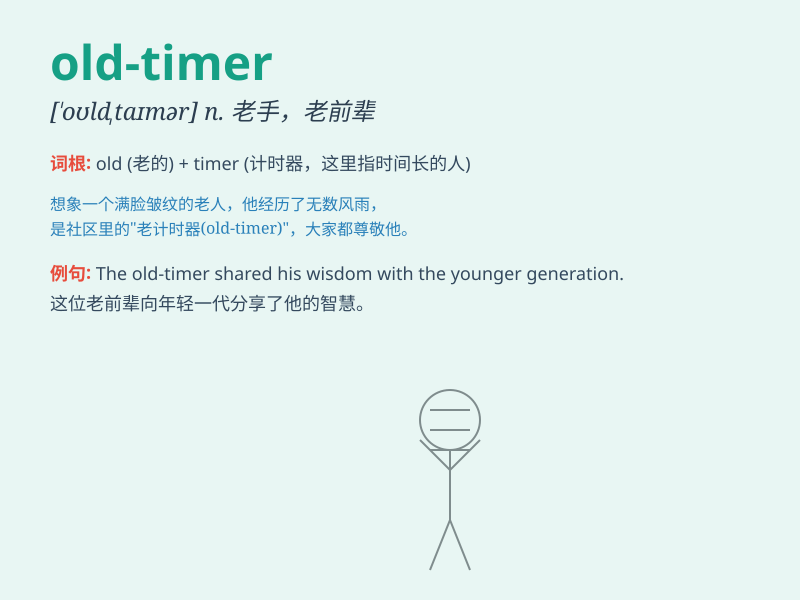

## old-timer

**英音:** _[əʊld ˈtaɪmə]_ **美音:** _[oʊld ˈtaɪmər]_

**译义:** *n. 老手，老资格的人；老式的东西；老式汽车*

### 短语

+ **an old-timer in something:** _在某方面的老手_

+ **old-timer\'s story:** _老手的故事_

+ **old-timer\'s experience:** _老手的经验_

+ **respect the old-timer:** _尊重老手_

+ **listen to the old-timer:** _听老手的话_

### 例句

#### 例句1

> **The old-timer at the factory has decades of experience.**

**中文翻译:** 工厂里的这位老手有几十年的经验。

**单词释义:** 经验丰富的人

#### 例句2

> **My grandfather is an old-timer when it comes to farming.**

**中文翻译:** 在务农方面，我的祖父是个老手。

**单词释义:** 老手；经验丰富的人

#### 例句3

> **The old-timer in the baseball team is a source of inspiration for
the younger players.**

**中文翻译:** 棒球队里的这位老队员是年轻队员的激励源泉。

**单词释义:** 资深队员；老资格

### 背诵小故事

> There was an old-timer in our town. He knew every corner and every
story. One day, I got lost and he guided me home. His wisdom and
experience made him a respected figure.

**在我们镇上有一位老前辈。他知晓每一个角落和每一个故事。有一天，我迷路了，他把我领回了家。他的智慧和经验使他成为一位备受尊敬的人物。**

### 图义

