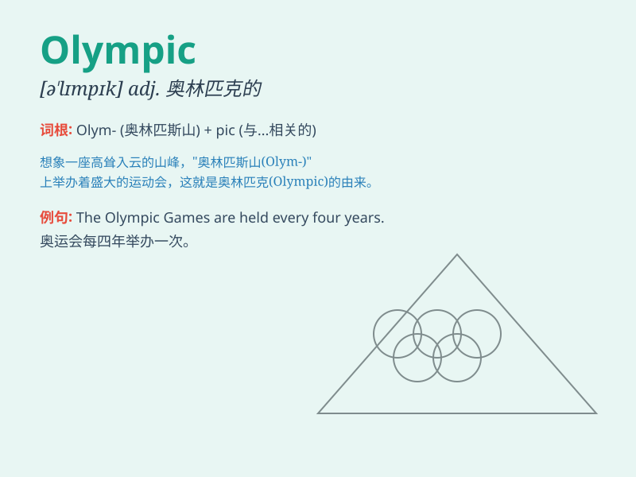

## Olympic

**英音:** _[əˈlɪmpɪk]_ **美音:** _[oʊˈlɪmpɪk]_

**译义:** *adj.奥林匹克的;奥林匹斯山的n.奥林匹克运动会*

### 短语

+ **Olympic Games:** _奥林匹克运动会_

+ **Olympic Committee:** _奥林匹克委员会_

+ **Olympic athlete:** _奥林匹克运动员_

+ **Olympic spirit:** _奥林匹克精神_

+ **Olympic torch:** _奥林匹克火炬_

### 例句

#### 例句1

> **The Olympic Games are held every four years.**

**中文翻译:** 奥林匹克运动会每四年举办一次。

**单词释义:** 奥林匹克的

#### 例句2

> **She is training hard for the Olympic trials.**

**中文翻译:** 她正在为奥林匹克选拔赛努力训练。

**单词释义:** 奥林匹克的

#### 例句3

> **The Olympic spirit inspires athletes from all over the world.**

**中文翻译:** 奥林匹克精神激励着来自世界各地的运动员。

**单词释义:** 奥林匹克的

### 背诵小故事

> In a small village, a young athlete dreamed of participating in the
Olympic Games. He trained hard every day. Finally, his dream came true
and he stood on the Olympic stage. The Olympic means related to the
greatest sports event in the world.

**在一个小村庄里，一位年轻运动员梦想参加奥林匹克运动会。他每天刻苦训练。最终，他的梦想成真，站在了奥林匹克的舞台上。Olympic
意思是与世界上最盛大的体育赛事有关的。**

### 图义

