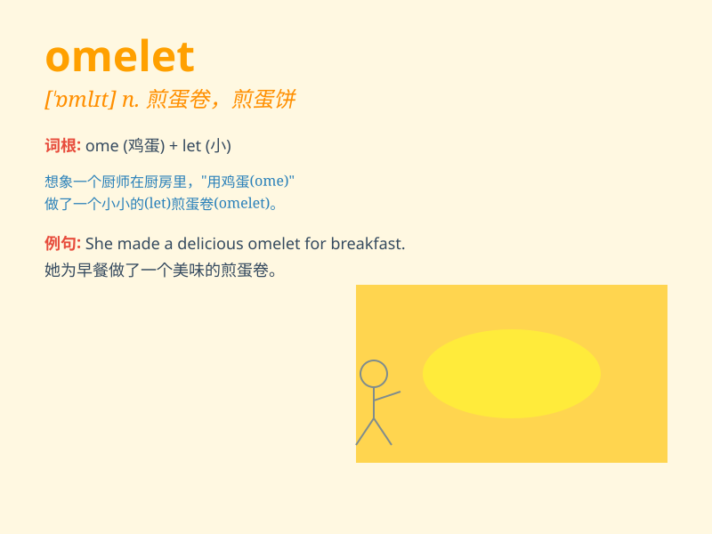

## omelet

**英音:** _[ˈɒmlɪi]_ **美音:** _[ˈɑmlət]_

**译义:** *n.煎蛋卷*

### 短语

+ **cheese omelet:** _奶酪煎蛋卷_

+ **ham omelet:** _火腿煎蛋卷_

+ **vegetable omelet:** _蔬菜煎蛋卷_

+ **make an omelet:** _做煎蛋卷_

+ **eat an omelet:** _吃煎蛋卷_

### 例句

#### 例句1

> **I\'m going to make an omelet for breakfast.**

**中文翻译:** 我要做煎蛋卷当早餐。

**单词释义:** 煎蛋卷

#### 例句2

> **The chef prepared a delicious omelet with cheese and
mushrooms.**

**中文翻译:** 厨师准备了美味的煎蛋卷，里面有奶酪和蘑菇。

**单词释义:** 煎蛋卷

#### 例句3

> **She added some tomatoes to the omelet to make it more
colorful.**

**中文翻译:** 她在煎蛋卷里加了一些西红柿，让它的颜色更加鲜艳。

**单词释义:** 煎蛋卷

### 背诵小故事

> One day, a hungry chef decided to make an omelet. He cracked some
eggs, added cheese and vegetables, and cooked it carefully. The
delicious omelet was ready, and it filled his stomach. Remember, omelet
means a dish made of eggs!

**有一天，一位饥饿的厨师决定做个煎蛋卷。他敲开一些鸡蛋，加入奶酪和蔬菜，仔细烹饪。美味的煎蛋卷做好了，填饱了他的肚子。记住，omelet
意思是一种用鸡蛋做的菜肴！**

### 图义

