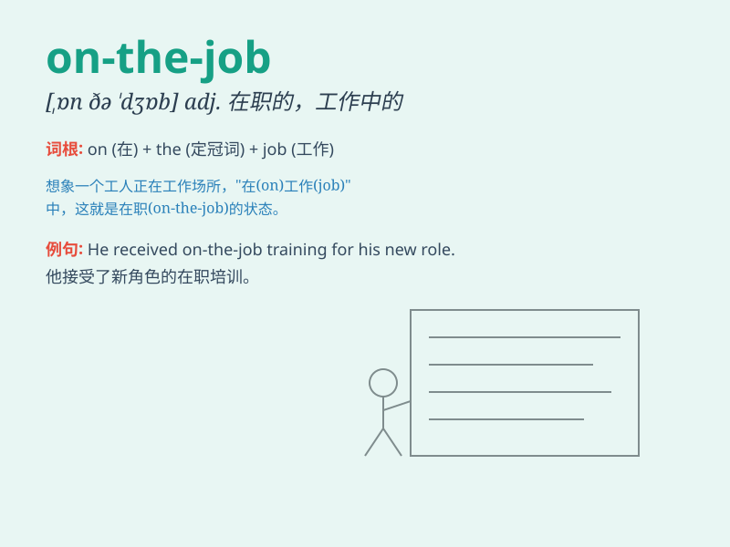

## on-the-job

**英音:** _null_ **美音:** _null_

**译义:** *null*

### 短语

+ **on-the-job training:** _在职培训_

+ **on-the-job experience:** _工作经验_

+ **on-the-job injury:** _工伤_

+ **on-the-job stress:** _工作压力_

+ **on-the-job performance:** _工作表现_

### 例句

#### 例句1

> **He gained valuable skills through on-the-job training.**

**中文翻译:** 他通过在职培训获得了宝贵的技能。

**单词释义:** 在职的

#### 例句2

> **The company provides on-the-job support to new employees.**

**中文翻译:** 公司为新员工提供在职支持。

**单词释义:** 在职的

#### 例句3

> **She had an on-the-job accident last week.**

**中文翻译:** 她上周发生了一起在职事故。

**单词释义:** 在职的

### 背诵小故事

> A young man named Tom was very hardworking. One day, his boss praised
him for his excellent performance on-the-job. It means doing the work
while actually at the workplace. Tom was happy and continued to work
hard.

**一个叫汤姆的年轻人工作非常努力。有一天，他的老板称赞他在职场上的出色表现。这个词意思是在工作场所实际工作时。汤姆很高兴，并继续努力工作。**

### 图义

