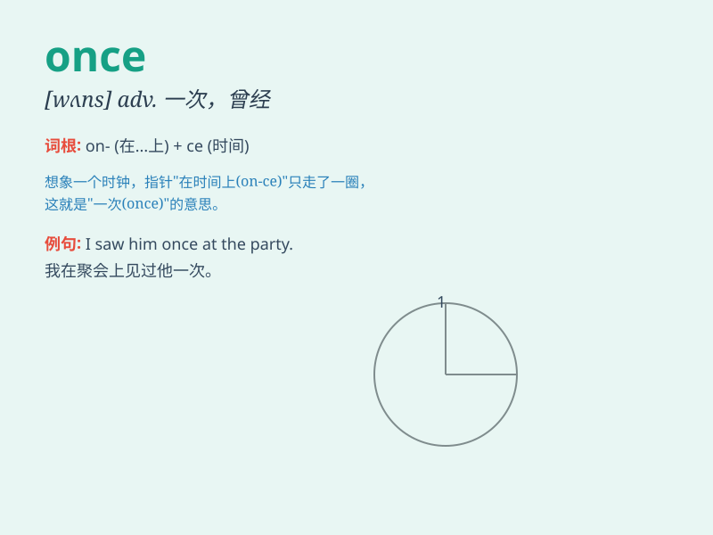

## once

**英音:** _[wʌns]_ **美音:** _[wʌns]_

**译义:** *n.adv.一次,从前,曾经 conj.一旦*

### 短语

+ **once in a while:** _偶尔；有时_

+ **all at once:** _突然；同时_

+ **once again:** _再一次；又一次_

+ **once upon a time:** _从前_

+ **at once:** _立刻；马上_

### 例句

#### 例句1

> **Once I was a little child, I was very shy.**

**中文翻译:** 曾经我是个小孩子的时候，我非常害羞。

**单词释义:** 曾经

#### 例句2

> **You should do it once and for all.**

**中文翻译:** 你应该一劳永逸地把它做了。

**单词释义:** 一次；彻底地

#### 例句3

> **Once you start, you should never give up.**

**中文翻译:** 一旦你开始，就绝不应该放弃。

**单词释义:** 一旦

### 背诵小故事

> Once upon a time, there was a little boy. He had only one chance to
go to the fair. He was very excited because it was a once-in-a-lifetime
opportunity.

**从前，有一个小男孩。他只有一次去集市的机会。他非常兴奋，因为这是一生只有一次的机会。**

### 图义

