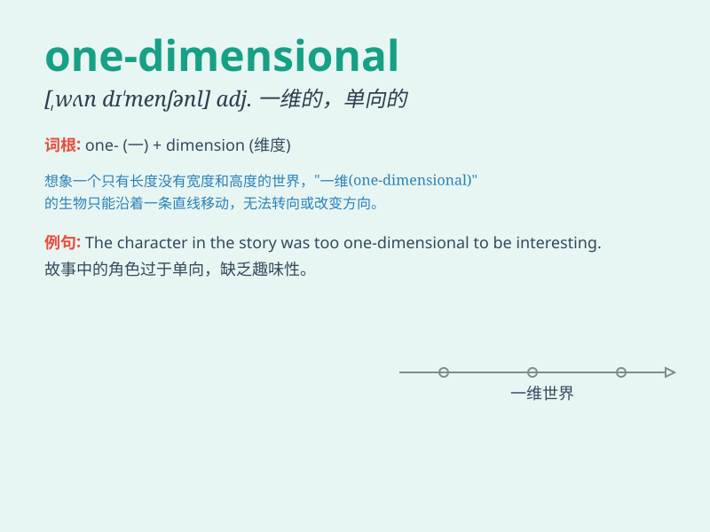

## one-dimensional

**英音:** _[ˌwʌn dɪˈmenʃənl]_ **美音:** _[ˌwʌn
dɪˈmenʃənl]_

**译义:** *adj. 一维的；线性的；单向的*

### 短语

+ **one-dimensional thinking:** _一维思维；单向思维_

+ **one-dimensional character:** _一维性格；单一性格_

+ **one-dimensional space:** _一维空间_

+ **one-dimensional model:** _一维模型_

+ **one-dimensional analysis:** _一维分析_

### 例句

#### 例句1

> **The character in the novel is rather one-dimensional, lacking
depth and complexity.**

**中文翻译:** 这部小说中的人物相当单一，缺乏深度和复杂性。

**单词释义:** 单一的，一维的

#### 例句2

> **The artist criticized the modern art exhibition as being too
one-dimensional in its approach.**

**中文翻译:** 这位艺术家批评现代艺术展览的方法太单一。

**单词释义:** 单调的，缺乏变化的

#### 例句3

> **His thinking on this issue is rather one-dimensional; he fails to
consider multiple perspectives.**

**中文翻译:** 他在这个问题上的思考相当一维；他没有考虑到多种观点。

**单词释义:** 片面的，狭隘的

### 背诵小故事

> Imagine a straight line. It only moves forward or backward. It has no
width or depth, just length. This line is like the concept of
\'one-dimensional\'. It\'s very simple and has only one direction.

**想象一条直线。它只能向前或向后移动。它没有宽度或深度，只有长度。这条线就像\'one-dimensional（一维的）\'这个概念。它非常简单，只有一个方向。**

### 图义

