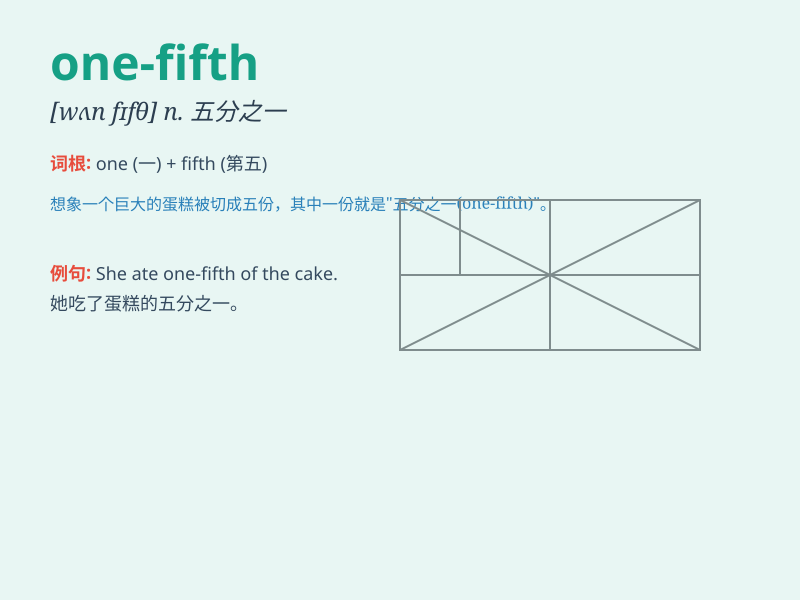

## one-fifth

**英音:** _[wʌn-fɪfθ]_ **美音:** _[wʌn-fɪfθ]_

**译义:** *n.五分之一的部分或整体；adj.占总数五分之一的*

### 短语

+ **one-fifth of:** _\...\...的五分之一_

+ **one-fifth part:** _五分之一部分_

+ **about one-fifth:** _大约五分之一_

+ **less than one-fifth:** _少于五分之一_

+ **more than one-fifth:** _多于五分之一_

### 例句

#### 例句1

> **One-fifth of the students in our class are from other cities.**

**中文翻译:** 我们班五分之一的学生来自其他城市。

**单词释义:** 五分之一

#### 例句2

> **The company spends one-fifth of its budget on research and
development.**

**中文翻译:** 这家公司把预算的五分之一用于研发。

**单词释义:** 五分之一

#### 例句3

> **Only one-fifth of the land is suitable for farming.**

**中文翻译:** 只有五分之一的土地适合耕种。

**单词释义:** 五分之一

### 背诵小故事

> Imagine a big pizza cut into five equal slices. You take just one of
those slices. That one slice represents one-fifth of the whole pizza.
So, one-fifth means one part out of five equal parts.

**想象一个大披萨被切成了五等份。你只拿其中的一份。那一份就代表了整个披萨的五分之一。所以，one-fifth
意思是五个相等部分中的一个部分。**

### 图义

