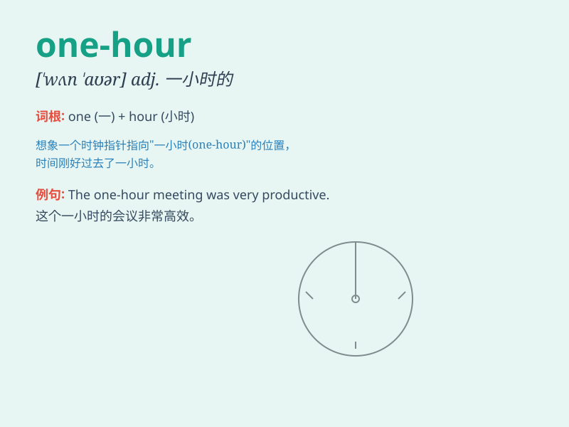

## one-hour

**英音:** _[wʌn ˈaʊə]_ **美音:** _[wʌn ˈaʊər]_

**译义:** *n. 一小时的时间段；adj. 持续一小时的*

### 短语

+ **one-hour break:** _一小时的休息_

+ **one-hour drive:** _一小时的车程_

+ **one-hour meeting:** _一小时的会议_

+ **one-hour lecture:** _一小时的讲座_

+ **one-hour workout:** _一小时的锻炼_

### 例句

#### 例句1

> **The one-hour meeting was very productive.**

**中文翻译:** 这个一小时的会议非常有成效。

**单词释义:** 一小时的

#### 例句2

> **She took a one-hour nap after lunch.**

**中文翻译:** 她午饭后小睡了一个小时。

**单词释义:** 一小时的

#### 例句3

> **The one-hour documentary was fascinating.**

**中文翻译:** 这部一小时的纪录片非常吸引人。

**单词释义:** 一小时的

### 背诵小故事

> Imagine you are in a race. The rule is you have to finish it in
one-hour. You run as fast as you can, constantly looking at your watch.
One-hour is the time limit that keeps you focused and determined.

**想象一下你在参加一场比赛。规则是你必须在一小时内完成。你拼命地跑，不停地看手表。一小时就是让你保持专注和坚定的时间限制。**

### 图义

