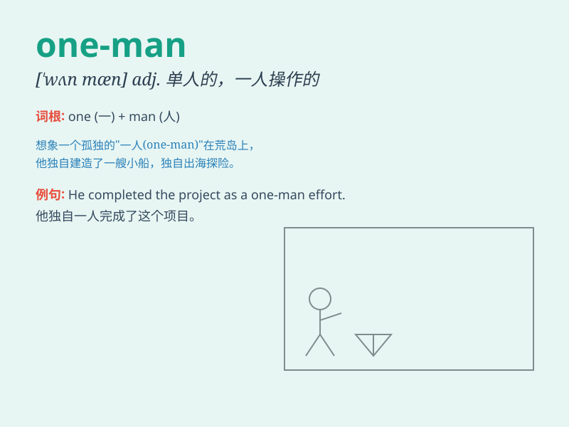

## one-man

**英音:** _[wʌn mæn]_ **美音:** _[wʌn mæn]_

**译义:** *adj. 单人的；一人操作的；一人控制的*

### 短语

+ **one-man show:** _单人表演；独角戏_

+ **one-man business:** _一人经营的生意_

+ **one-man band:** _一人乐队_

+ **one-man rule:** _独裁统治；专制统治_

+ **one-man operation:** _单人操作_

### 例句

#### 例句1

> **The company was run by a one-man operation.**

**中文翻译:** 这家公司是由一个人的经营运作的。

**单词释义:** 单人的；一人的

#### 例句2

> **He put on a one-man show at the local theater.**

**中文翻译:** 他在当地剧院上演了一场单人表演。

**单词释义:** 单人的；一人的

#### 例句3

> **The one-man band attracted a lot of attention.**

**中文翻译:** 这个一人乐队吸引了很多关注。

**单词释义:** 单人的；一人的

### 背诵小故事

> Once upon a time, there was a small company. It was run by only one
man. He did everything from sales to accounting. This is the meaning of
\'one-man\', referring to something operated or done by a single person.

**从前，有一家小公司。它仅由一个人经营。他从销售到会计，什么都做。这就是'one-man'的意思，指由单人操作或完成的事情。**

### 图义

