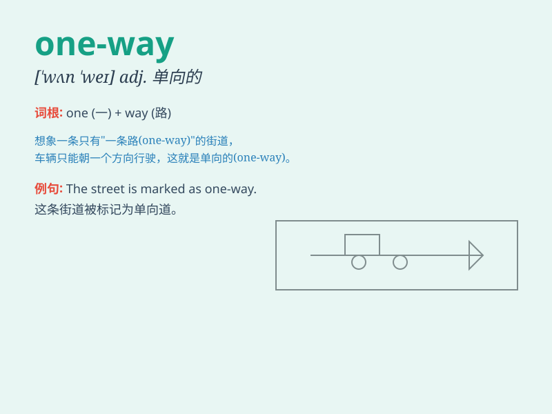

## one-way

**英音:** _[wʌn weɪ]_ **美音:** _[wʌn weɪ]_

**译义:** *adj. 单向的；单程的；单方面的*

### 短语

+ **one-way street:** _单行道_

+ **one-way ticket:** _单程票_

+ **one-way communication:** _单向通信；单向沟通_

+ **one-way trip:** _单程旅行_

+ **one-way valve:** _单向阀_

### 例句

#### 例句1

> **This is a one-way street. **

**中文翻译:** 这是一条单行道。

**单词释义:** 单向的；单行道的

#### 例句2

> **The one-way ticket costs less than the round-trip ticket. **

**中文翻译:** 单程票比往返票便宜。

**单词释义:** 单程的

#### 例句3

> **Our communication seems to be one-way. I\'m always the one
sharing, but you never do. **

**中文翻译:**
我们的交流似乎是单向的。我总是那个分享的人，但你从不分享。

**单词释义:** 单向的；单方面的

### 背诵小故事

>
想象一下你在一条狭窄的小道上，只能朝着一个方向前进，没有回头路。这就像\'one-way\'所表示的单程、单向。就像这条小道，one-way
的路线是固定且不可逆转的。

**想象在狭窄小道只能朝一个方向前进的情景来辅助理解\'one-way\'表示单程、单向的意思，路线固定不可逆转。**

### 图义

