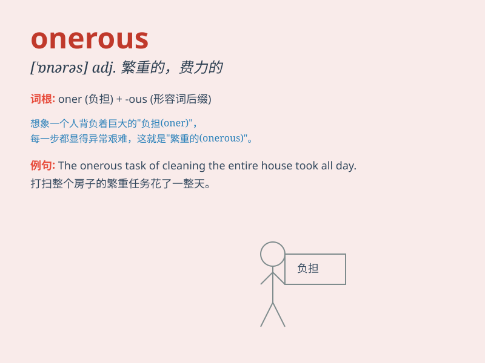

## onerous

**英音:** _[\'əʊn(ə)rəs; \'ɒn-]_ **美音:** _[\'ɑnərəs]_

**译义:** *adj.繁重的,费力的,负有法律责任的*

### 短语

+ **onerous duty:** _繁重的职责_

+ **onerous task:** _艰巨的任务_

+ **onerous obligation:** _繁重的义务_

+ **onerous burden:** _沉重的负担_

+ **onerous responsibility:** _重大的责任_

### 例句

#### 例句1

> **The task was onerous, requiring long hours of concentration.**

**中文翻译:** 这项任务很繁重，需要长时间集中精力。

**单词释义:** 繁重的；艰巨的

#### 例句2

> **The new regulations impose an onerous burden on small
businesses.**

**中文翻译:** 新规定给小企业带来了沉重的负担。

**单词释义:** 沉重的；费力的

#### 例句3

> **Fulfilling these obligations will be an onerous undertaking.**

**中文翻译:** 履行这些义务将是一项艰巨的任务。

**单词释义:** 艰难的；麻烦的

### 背诵小故事

> A poor student had an onerous task of writing ten long essays in one
week. It was so difficult and burdensome that he felt very stressed. But
he finally finished it with great effort.

**一个贫困的学生有一项繁重的任务，要在一周内写十篇长论文。这任务如此艰难和沉重，让他感到压力巨大。但他最终还是努力完成了。**

### 图义

