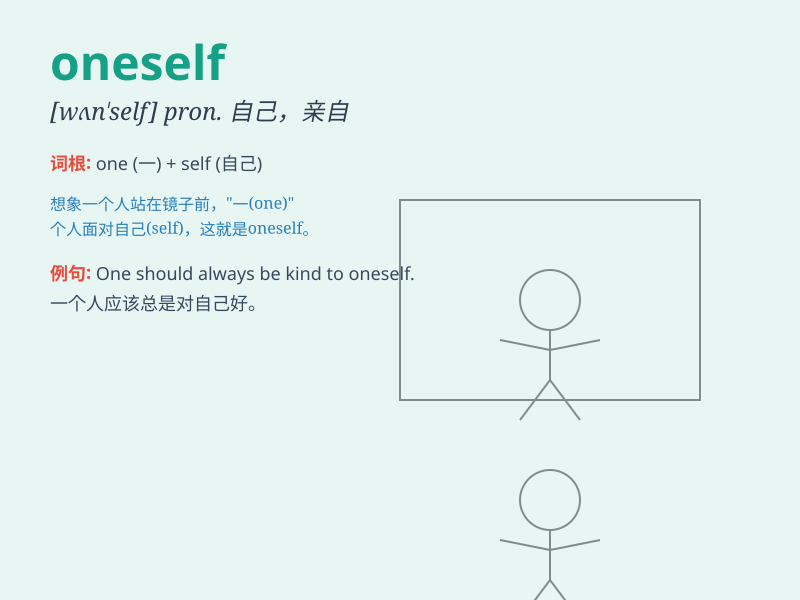

## oneself

**英音:** _[wʌn\'self]_ **美音:** _[wʌn\'sɛlf]_

**译义:** * pron.自己,亲自*

### 短语

+ **by oneself:** _独自；单独_

+ **for oneself:** _为自己；亲自_

+ **of oneself:** _自动地；自发地_

+ **in oneself:** _本身；本质上_

+ **to oneself:** _独占；独用_

### 例句

#### 例句1

> **One should take care of oneself.**

**中文翻译:** 一个人应该照顾好自己。

**单词释义:** 自己

#### 例句2

> **She enjoys being by oneself.**

**中文翻译:** 她喜欢独自一人。

**单词释义:** 独自

#### 例句3

> **One must believe in oneself to succeed.**

**中文翻译:** 一个人要成功就必须相信自己。

**单词释义:** 自己

### 背诵小故事

> One day, a little bear was lost in the forest. It had to rely on
oneself to find the way home. It kept telling itself to be brave and
finally succeeded. It learned the importance of depending on oneself.

**一天，一只小熊在森林里迷路了。它不得不依靠自己找到回家的路。它一直告诉自己要勇敢，最后成功了。它明白了依靠自己的重要性。**

### 图义

