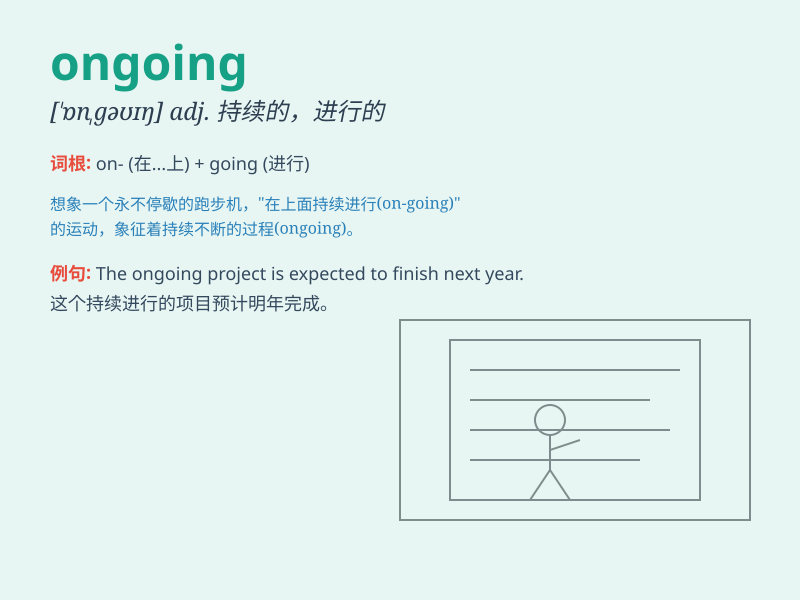

## ongoing

**英音:** _[\'ɒngəʊɪŋ]_ **美音:** _[\'ɑnɡoɪŋ]_

**译义:** *adj.正在进行的*

### 短语

+ **ongoing project:** _正在进行的项目_

+ **ongoing process:** _正在进行的过程_

+ **ongoing work:** _正在进行的工作_

+ **ongoing investigation:** _正在进行的调查_

+ **ongoing discussion:** _正在进行的讨论_

### 例句

#### 例句1

> **The ongoing project requires more resources.**

**中文翻译:** 正在进行的项目需要更多的资源。

**单词释义:** 正在进行的

#### 例句2

> **There is an ongoing debate about climate change.**

**中文翻译:** 关于气候变化有一场正在进行的辩论。

**单词释义:** 正在进行的

#### 例句3

> **The ongoing investigation has raised many questions.**

**中文翻译:** 正在进行的调查引发了许多问题。

**单词释义:** 正在进行的

### 背诵小故事

>
想象一下，有一场永不停歇的马拉松比赛正在进行（ongoing），选手们不停地奔跑。这场比赛没有终点，一直持续着，就像
ongoing 所表示的正在进行且持续的状态。

**想象一场持续进行的马拉松比赛来记住 ongoing
表示正在进行且持续的意思**

### 图义

