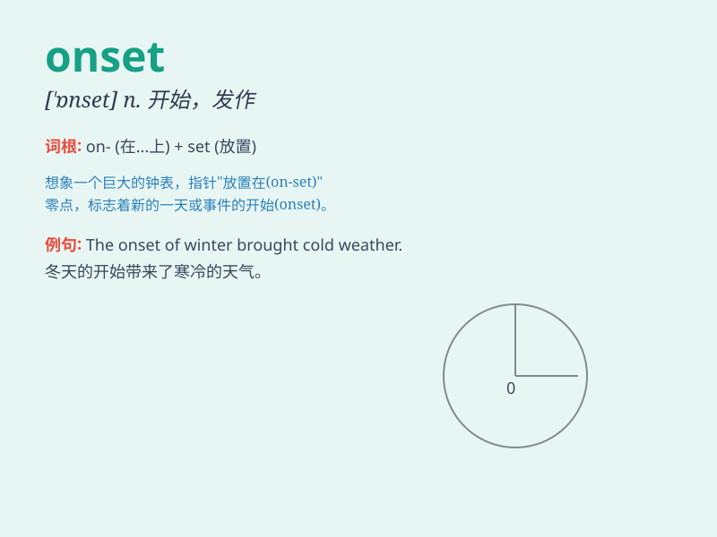

## onset

**英音:** _[\'ɒnset]_ **美音:** _[\'ɑnsɛt]_

**译义:** *n.攻击,进攻,有力的开始,肇端n.[医]发作*

### 短语

+ **at the onset:** _在开始时_

+ **the onset of disease:** _疾病的发作_

+ **sudden onset:** _突然发作_

+ **early onset:** _早期发作_

+ **onset age:** _发病年龄_

### 例句

#### 例句1

> **The onset of winter brings colder weather.**

**中文翻译:** 冬天的开始带来了更寒冷的天气。

**单词释义:** 开始；起始

#### 例句2

> **The patient experienced an acute onset of pain.**

**中文翻译:** 这位病人突然感到剧痛。

**单词释义:** 发作；突然开始

#### 例句3

> **The onset of the disease was rapid and unexpected.**

**中文翻译:** 这种疾病的发作迅速且出乎意料。

**单词释义:** 发作；开始

### 背诵小故事

> A brave warrior was ready to face the onset of the enemy. He stood
firm, knowing that this was the beginning of a fierce battle. The
\'onset\' of the enemy\'s attack was a crucial moment.

**一位勇敢的战士准备面对敌人的攻击。他坚定地站着，知道这是一场激烈战斗的开始。敌人攻击的'开始、发作'是关键时刻。**

### 图义

