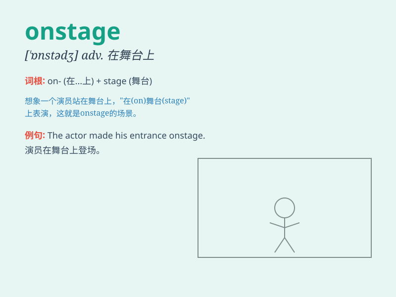

## onstage

**英音:** _[ɒn\'steɪdʒ]_ **美音:** _[\'ɔn\'stedʒ]_

**译义:** *adj.舞台表演区的 台上的,台上演出的*

### 短语

+ **go onstage:** _上台；登场_

+ **be onstage:** _在台上；在舞台上_

+ **appear onstage:** _出现在舞台上_

+ **come onstage:** _走上舞台_

+ **stay onstage:** _留在舞台上_

### 例句

#### 例句1

> **The actor walked onstage and received a huge round of
applause.**

**中文翻译:** 这位演员走上舞台，获得了一阵热烈的掌声。

**单词释义:** 在舞台上

#### 例句2

> **She looked nervous when she was onstage.**

**中文翻译:** 她在舞台上时看起来很紧张。

**单词释义:** 在舞台上

#### 例句3

> **The band performed onstage for two hours.**

**中文翻译:** 乐队在舞台上表演了两个小时。

**单词释义:** 在舞台上

### 背诵小故事

> A young actor was very nervous when he was onstage for the first
time. But when he saw the warm smiles from the audience, he became
confident and gave a wonderful performance.

**一位年轻的演员第一次上台时非常紧张。但当他看到观众们温暖的笑容时，他变得自信并给出了精彩的表演。**

### 图义

