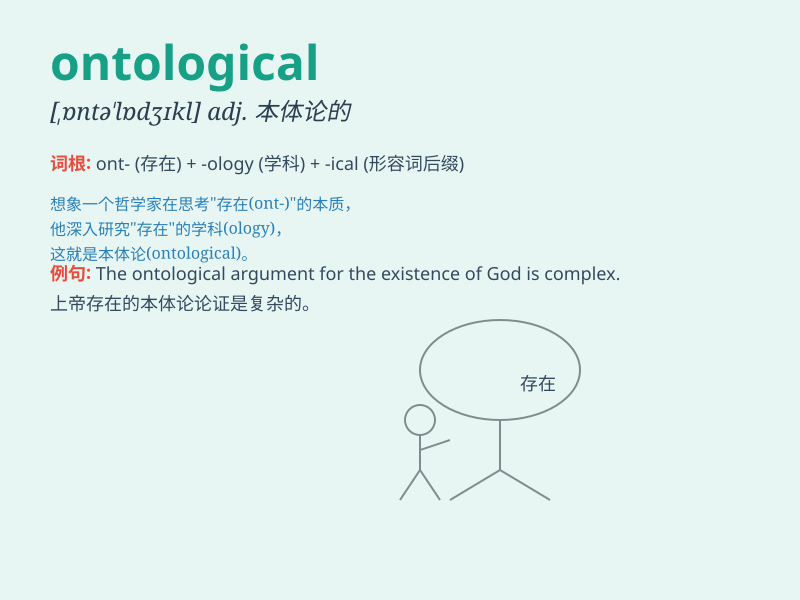

## ontological

**英音:** _[ˌɒntə\'lɒdʒɪkl]_ **美音:**
_[ˌɒntə\'lɒdʒɪkl]_

**译义:** *adj.[哲]
存在论的,本体论的adj.[哲]本体论的,实体论的*

### 短语

+ **ontological commitment:** _本体论承诺_

+ **ontological argument:** _本体论论证_

+ **ontological category:** _本体论范畴_

+ **ontological foundation:** _本体论基础_

+ **ontological status:** _本体论地位_

### 例句

#### 例句1

> **The ontological question of the nature of reality has puzzled
philosophers for centuries.**

**中文翻译:** 关于现实本质的本体论问题几个世纪以来一直困扰着哲学家。

**单词释义:** 关于本体论的

#### 例句2

> **His research focuses on ontological aspects of artificial
intelligence.**

**中文翻译:** 他的研究侧重于人工智能的本体论方面。

**单词释义:** 本体论的

#### 例句3

> **The ontological status of virtual objects is a subject of debate
in the field of computer science.**

**中文翻译:**
虚拟对象的本体论地位在计算机科学领域是一个有争议的话题。

**单词释义:** 本体论的

### 背诵小故事

> A philosopher was always exploring ontological questions. He dreamt
of entering a magical world where everything had its essential nature.
One day, he found the key to understanding ontological concepts and
unlocked the secrets of existence.

**一位哲学家总是在探索本体论的问题。他梦想进入一个神奇的世界，在那里一切都有其本质。有一天，他找到了理解本体论概念的关键，揭开了存在的秘密。**

### 图义

