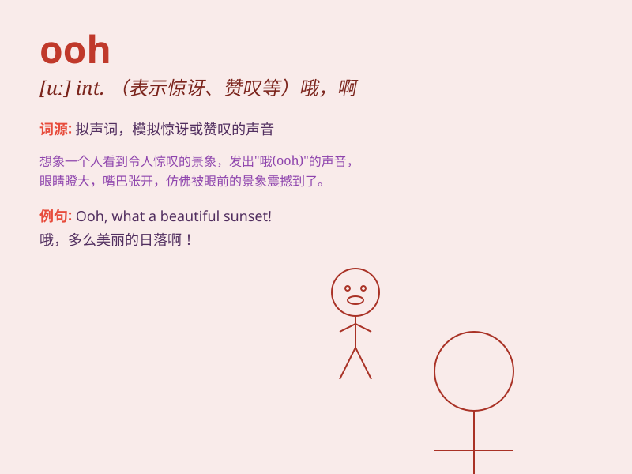

## ooh

**英音:** _/uː/_ **美音:** _/u/_

**译义:** *叹.哎哟(表示惊讶、喜悦等)*

### 短语

+ **ooh and aah:** _表示惊奇、羡慕或兴奋地赞叹_

+ **ooh la la:** _（表示惊讶、羡慕或兴奋）哇，哎呀_

+ **ooh baby:** _哦，宝贝（表示亲昵或喜爱）_

+ **ooh lovely:** _哦，真可爱_

+ **ooh dear:** _哦，天哪（表示惊讶、担心等）_

### 例句

#### 例句1

> **Ooh, this cake looks delicious!**

**中文翻译:** 哦，这个蛋糕看起来很美味！

**单词释义:** 表示惊讶、欣喜

#### 例句2

> **Ooh, I\'m so excited about the trip.**

**中文翻译:** 哦，我对这次旅行太兴奋了。

**单词释义:** 表达兴奋

#### 例句3

> **Ooh, that\'s a beautiful dress.**

**中文翻译:** 哦，那是一件漂亮的连衣裙。

**单词释义:** 表示赞叹

### 背诵小故事

>
有一天，小明和朋友们去森林探险，突然看到一只美丽的蝴蝶。大家都兴奋地喊
\'ooh\' ，表示惊喜和赞叹。这个声音就像他们内心的激动一下子爆发了出来。

**有一天，小明和朋友们在森林看到蝴蝶，大家喊\'哦\'表示惊喜和赞叹，以此辅助记忆单词\'ooh\'。**

### 图义

