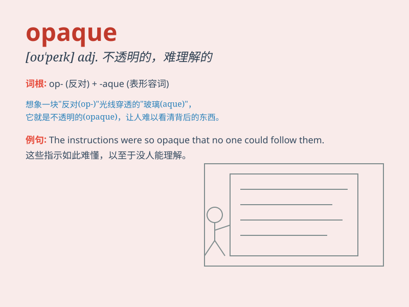

## opaque

**英音:** _[ə(ʊ)\'peɪk]_ **美音:** _[o\'pek]_

**译义:** *n.不透明物adj.不透明的,不传热的,迟钝的*

### 短语

+ **opaque glass:** _不透明玻璃_

+ **opaque material:** _不透明材料_

+ **opaque liquid:** _不透明液体_

+ **opaque object:** _不透明物体_

+ **opaque surface:** _不透明表面_

### 例句

#### 例句1

> **The window was opaque, blocking the view from outside.**

**中文翻译:** 窗户是不透明的，阻挡了从外面看进来的视线。

**单词释义:** 不透明的

#### 例句2

> **His explanations were opaque and difficult to understand.**

**中文翻译:** 他的解释晦涩难懂。

**单词释义:** 晦涩的；难以理解的

#### 例句3

> **The report was written in such an opaque style that it needed
clarification.**

**中文翻译:** 这份报告的写作风格如此模糊，需要加以澄清。

**单词释义:** 模糊的

### 背诵小故事

>
想象一个神秘的城堡，城堡的窗户被一种特殊材料覆盖，外面的人完全看不到里面。这种材料就是
opaque，它不透光，让城堡内部变得神秘莫测。

**想象一个城堡，窗户被不透光的特殊材料覆盖，这种材料就是opaque，意为不透明的、晦涩的。**

### 图义

