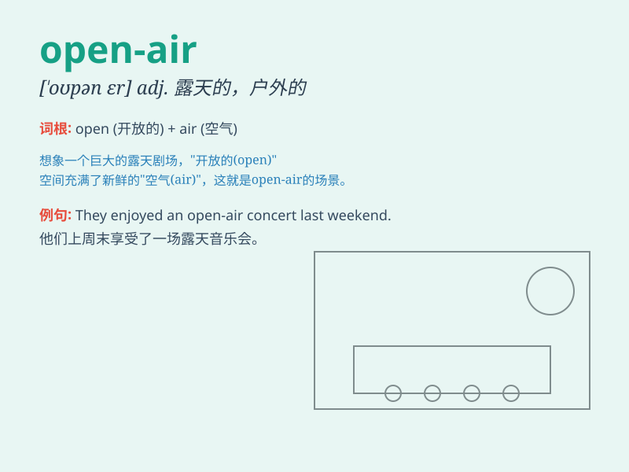

## open-air

**英音:** _[ˈəʊp.nɛː(r)]_ **美音:** _[ˈoʊ.pənˌɛr]_

**译义:** *形容词，表示在户外的，露天的*

### 短语

+ **open-air concert:** _露天音乐会_

+ **open-air market:** _露天市场_

+ **open-air swimming pool:** _露天游泳池_

+ **open-air cafe:** _露天咖啡馆_

+ **open-air theatre:** _露天剧场_

### 例句

#### 例句1

> **We had a picnic in the open-air park.**

**中文翻译:** 我们在露天公园野餐。

**单词释义:** 露天的

#### 例句2

> **The open-air concert attracted thousands of people.**

**中文翻译:** 这场露天音乐会吸引了数千人。

**单词释义:** 露天的

#### 例句3

> **They enjoy doing exercise in the open-air gym.**

**中文翻译:** 他们喜欢在露天健身房锻炼。

**单词释义:** 露天的

### 背诵小故事

> One sunny day, I decided to go for a picnic. I found a beautiful
open-air place by the river. There were no walls or roofs, just fresh
air and nature. It was so relaxing and enjoyable.

**在一个阳光明媚的日子，我决定去野餐。我在河边找到一个美丽的露天场所。那里没有墙壁和屋顶，只有新鲜的空气和大自然。这是如此的放松和愉快。**

### 图义

