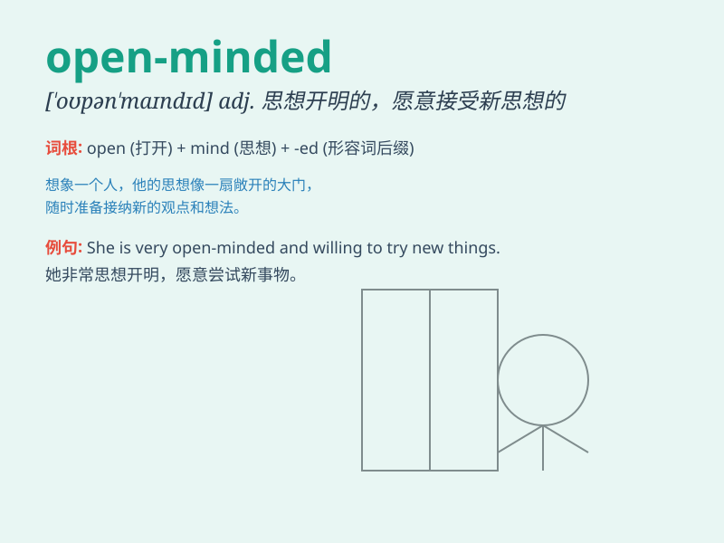

## open-minded

**英音:** _[ˌəʊpən ˈmaɪndɪd]_ **美音:** _[ˌoʊpən
ˈmaɪndɪd]_

**译义:** *adj.思想开明的；心胸开阔的*

### 短语

+ **be open-minded:** _思想开明；心胸开阔_

+ **an open-minded person:** _一个思想开明的人_

+ **remain open-minded:** _保持思想开明_

+ **open-minded attitude:** _开明的态度_

+ **become open-minded:** _变得思想开明_

### 例句

#### 例句1

> **She is an open-minded person who is always willing to try new
things.**

**中文翻译:** 她是一个思想开明的人，总是愿意尝试新事物。

**单词释义:** 思想开明的

#### 例句2

> **In order to make progress, we need to have an open-minded
attitude.**

**中文翻译:** 为了取得进步，我们需要有一个开放的心态。

**单词释义:** 开放的

#### 例句3

> **The company is looking for open-minded employees who can bring
fresh ideas.**

**中文翻译:** 公司正在寻找思想开放、能带来新想法的员工。

**单词释义:** 思想开放的

### 背诵小故事

> Once upon a time, there was a king. He was willing to listen to
different opinions and new ideas. People called him open-minded. Because
he had an open mind and was not limited by old thoughts, his kingdom
became prosperous.

**从前，有一位国王。他愿意倾听不同的意见和新的想法。人们称他思想开明。因为他有开放的心态，不受旧思想的限制，他的王国变得繁荣昌盛。**

### 图义

