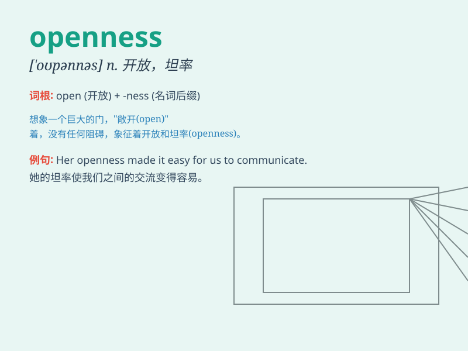

## openness

**英音:** _[\'əʊpənnɪs]_ **美音:** _[\'opənnəs]_

**译义:** *n.宽阔,公开*

### 短语

+ **emotional openness:** _情感的坦率_

+ **intellectual openness:** _智力上的开放性_

+ **attitudinal openness:** _态度上的开明_

+ **cultural openness:** _文化的开放性_

+ **psychological openness:** _心理上的开放_

### 例句

#### 例句1

> **The openness of the Internet has brought countless
opportunities.**

**中文翻译:** 互联网的开放性带来了无数的机会。

**单词释义:** 开放性

#### 例句2

> **Her openness to new ideas made her very successful in her
career.**

**中文翻译:** 她对新想法的开放态度使她在职业生涯中非常成功。

**单词释义:** 开放的态度

#### 例句3

> **The openness of the discussion allowed for a wide range of
perspectives.**

**中文翻译:** 讨论的开放性允许了各种各样的观点。

**单词释义:** 开放性

### 背诵小故事

> Once upon a time, there was a mysterious cave. Everyone was afraid to
enter because of its unknown. But a brave boy showed openness. He went
in and discovered a beautiful secret garden. Openness led him to new
wonders.

**从前，有一个神秘的洞穴。每个人都因未知而害怕进入。但一个勇敢的男孩表现出了开放性。他走进去，发现了一个美丽的秘密花园。开放性带他领略到了新的奇观。**

### 图义

