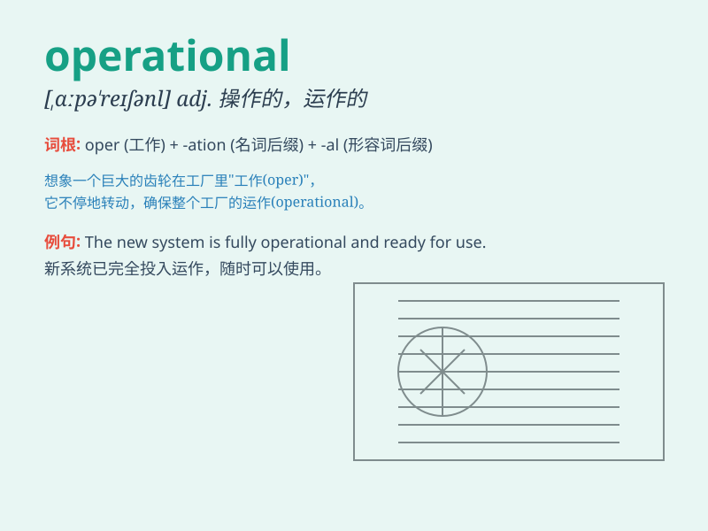

## operational

**英音:** _[ɒpə\'reɪʃ(ə)n(ə)l]_ **美音:**
_[\'ɑpə\'reʃənl]_

**译义:** *adj.操作的,运作的*

### 短语

+ **operational efficiency:** _运营效率_

+ **operational mode:** _运行模式_

+ **operational cost:** _运营成本_

+ **operational plan:** _运营计划_

+ **operational risk:** _运营风险_

### 例句

#### 例句1

> **The new machine is now operational.**

**中文翻译:** 这台新机器现在可以运行了。

**单词释义:** 运行的；操作的

#### 例句2

> **The operational costs of the business have increased.**

**中文翻译:** 企业的运营成本增加了。

**单词释义:** 运营的；业务的

#### 例句3

> **The operational details of the plan need to be worked out.**

**中文翻译:** 该计划的操作细节需要制定出来。

**单词释义:** 操作的；运作的

### 背诵小故事

>
想象一个工厂，机器轰鸣，工人忙碌。这一切有条不紊地进行着，因为工厂的运营系统（operational）非常完善。它确保了生产的顺利，就像一个精准的时钟，每个环节都精准运作。

**想象一个运营良好的工厂，以此来辅助记忆operational（运作的；操作的；运营的）这个单词**

### 图义

