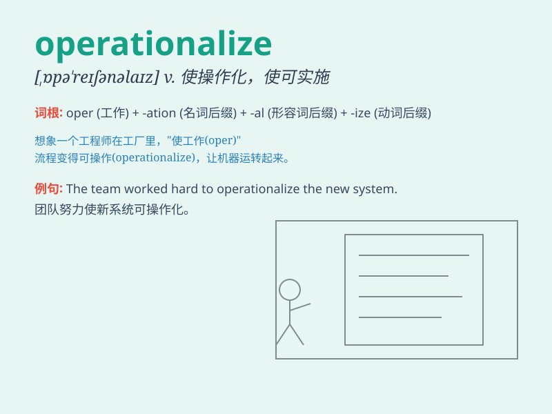

## operationalize

**英音:** _[ɒpə\'reɪʃənlaɪz]_ **美音:**
_[ˌɒpə\'reɪʃənlaɪz]_

**译义:** *vt.使用于操作,使开始运转,实施*

### 短语

+ **operationalize a plan:** _实施一项计划_

+ **operationalize a strategy:** _使策略可操作_

+ **operationalize a concept:** _将概念付诸实践_

+ **operationalize a model:** _使模型可运行_

+ **operationalize a system:** _使系统运作_

### 例句

#### 例句1

> **We need to operationalize this new strategy as soon as
possible.**

**中文翻译:** 我们需要尽快将这个新策略付诸实施。

**单词释义:** 使......付诸实施；使......可操作

#### 例句2

> **The company is struggling to operationalize its cost-cutting
plan.**

**中文翻译:** 这家公司正在努力实施其削减成本的计划。

**单词释义:** 实施；使运作

#### 例句3

> **How can we operationalize the concept of sustainable development
in our daily work?**

**中文翻译:**
在我们的日常工作中，我们怎样才能将可持续发展的概念付诸实践？

**单词释义:** 将......付诸实践；使......可操作

### 背诵小故事

> A scientist was working hard to operationalize a new theory. He spent
days in the lab, conducting experiments and adjusting parameters.
Finally, he made it happen and the theory became practical and usable.

**一位科学家努力将一个新理论付诸实践。他在实验室里花了好几天，进行实验并调整参数。最终，他成功了，这个理论变得切实可行且可用。**

### 图义

